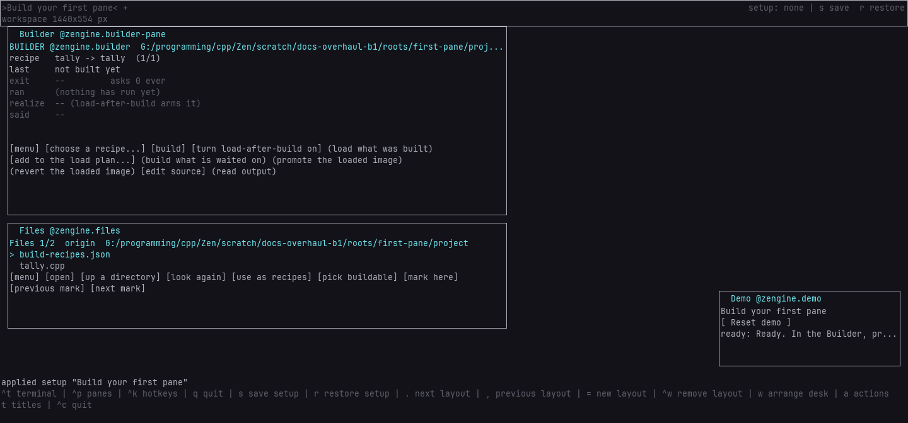
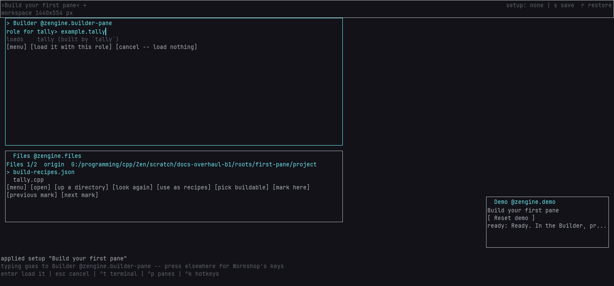
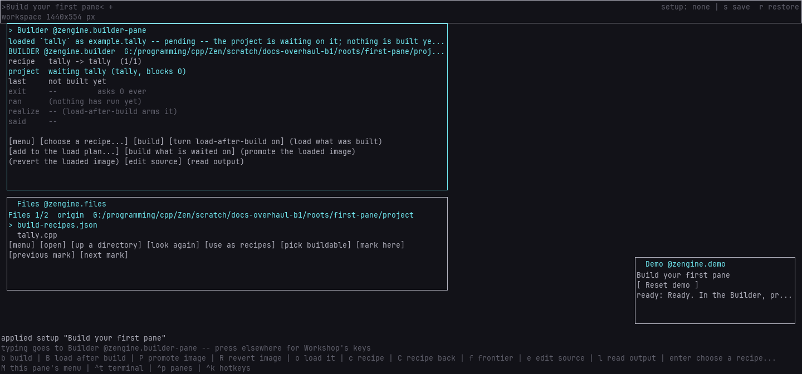
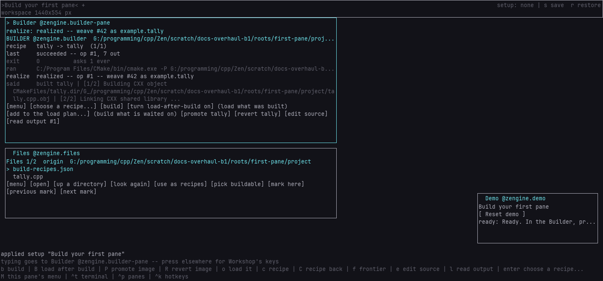
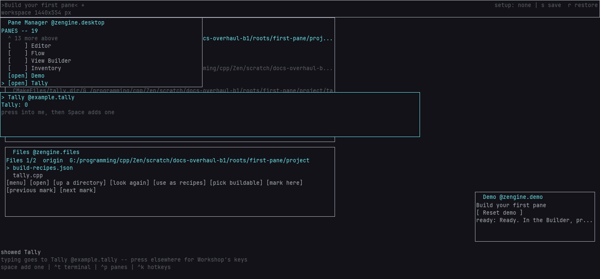

# Build your first pane

**Tutorial.** You will build a small pane, Tally, from one source file, put it into your project, and
open it in Workshop. At the end Tally is on your desk counting, and your project knows how to build it
and how to run it.

It takes about five minutes, most of it the first build.

## Before you start

You need Workshop built, and Zengine and the Loom installed into a folder (a *prefix*), as
[getting started](../../../../workshop/docs/getting-started.md) shows: Tally is built against what
you installed. Then start the tutorial's setup, from the Zengine folder. It makes a new project
holding `tally.cpp` and a recipe that builds it, and opens Workshop on it with the Builder and Files
on the desk:

```sh
python external-host/demo.py start --setup builder/docs/tutorials/build-your-first-pane \
    --root demo-runs/first-pane --build <your build folder> --loom-prefix <your installed Loom> \
    --zengine-prefix <your installed Zengine>
```

When it says `ready`, Workshop is open and the steps below begin.

## Step 1 -- Find the recipe

Look at the Builder, the pane at the top. Its `recipe` row says `tally -> tally`.



A **recipe** is an entry in your project's recipe file, `build-recipes.json`, that says how one file
is made: here, from `tally.cpp`. The name after the arrow is the file it makes, the **artifact**,
named without its `.dll` or `.so`. Your project has one recipe, so it is already the chosen one
([`builder.recipe`](../../zengine.builder-pane.md#builderrecipe) moves to another when there are
several).

## Step 2 -- Tell the project what Tally is

Press into the Builder so it holds your keys, then press <!-- key builder.load -->`o`<!-- /key -->.
A line opens at the bottom of the pane, asking for a role. Type `example.tally`.



Your project's **plan** says which weaves it runs and what each one is, its **role**. `tally.cpp`
speaks as `example.tally`, so that is the role its plan row must give it: a weave given another role
would never appear in the Pane Manager. This line is
[`builder.load`](../../zengine.builder-pane.md#builderload).

## Step 3 -- Add it to the plan

Press <!-- key authoring.commit -->`return`<!-- /key -->.



The row is added to the running project and written to your project's `workshop-plan.json`. Tally is
not built yet, so the project now waits on it: the `project` row says `waiting tally`. What a project
waits on is its **frontier** ([`authoring.commit`](../../zengine.builder-pane.md#authoringcommit)).

## Step 4 -- Build it and load it

Press <!-- key builder.frontier -->`f`<!-- /key -->.



The Builder builds the one recipe that makes what the project waits on, then hands the result to the
project, which loads it. The first build writes a small CMake project around `tally.cpp` and takes a
little while; the `last` row says `running` meanwhile, and Workshop stays usable. When it is done, the
`last` row says `succeeded` and the `realize` row says `realized`
([`builder.frontier`](../../zengine.builder-pane.md#builderfrontier)).

## Step 5 -- Open Tally

Press <!-- key desktop.panes -->`ctrl+p`<!-- /key --> for the Pane Manager, move to `Tally` and
press `return`.



Tally says `Tally: 0`, and your keys are in it.

## Step 6 -- Use it

Press `space` three times.


Each `space` adds one. The count lives in the weave, so it survives a reload, as the next
tutorial shows.

## What you have now

Your project holds `tally.cpp`, `build-recipes.json` with Tally's recipe, and `workshop-plan.json`
with its row. Launching Workshop from this project again loads Tally with the rest.

**Next**: [edit a running pane](../../edit-a-running-pane.md): change Tally while it runs, and keep
or take back the change, with load after build
([`builder.arm`](../../zengine.builder-pane.md#builderarm)), promote
([`builder.promote`](../../zengine.builder-pane.md#builderpromote)) and revert
([`builder.revert`](../../zengine.builder-pane.md#builderrevert)). Everything the Builder pane does is
in [its manual](../../zengine.builder-pane.md).
