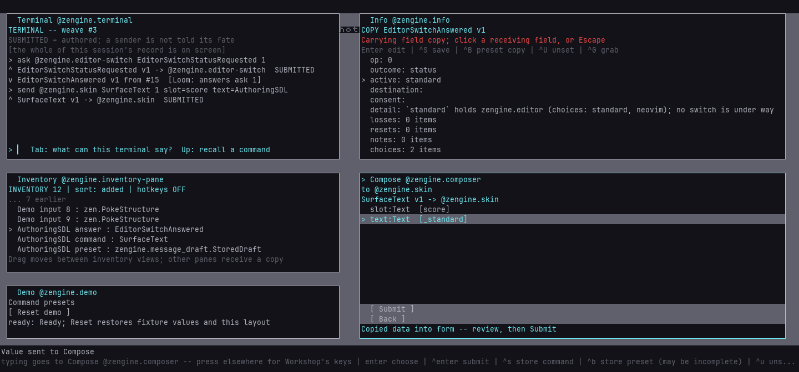

# Make a Workshop tool

**How-to.** Start with a loaded pane, add an interaction, and find out what happened when a
request does not finish. A tool is an ordinary weave that offers Workshop a pane. Workshop
owns its room and input routing; the weave owns the meaning and state of its contents.

## Start with the running example

Use [Tally](../../examples/tally-pane/tally.cpp), a small pane with one count and one action.
Follow [edit a running pane](../workshop/edit-a-running-pane.md) to copy it into a project,
build it, load it as `example.tally`, open it from the Pane Manager, and change/reload its code.
For a shipped pane, use [develop Workshop](../workshop/develop-workshop.md).

Read Tally in this order:

1. `TallyState` owns the count. Room dimensions and pending interactions are image-local.
2. `Accept` and `Emit` declare schema vocabulary; they confer no authority.
3. `offer()` announces the pane and its named action from its actual office.
4. `on(PaneRoom)` fits the rows to the room Workshop granted.
5. `on(PaneActionRequested)` checks authorship and pane identity before changing the count.

Change the label in `rows_for()` first. Then change the action's behavior. Keep its action id
stable when the meaning remains the same; declare a different action when the meaning changes.
The same-state reload walkthrough covers preservation and what a refused reload means.

To compile the unchanged example outside Zengine, put `tally.cpp` next to this `CMakeLists.txt`:

```cmake
cmake_minimum_required(VERSION 3.22)
project(my_tally LANGUAGES CXX)
find_package(zengine 0.1 CONFIG REQUIRED)
add_library(tally SHARED tally.cpp)
target_link_libraries(tally PRIVATE
    zengine::pane zengine::activation zengine::input loom::switchboard)
loom_weave_build_contract(tally)
```

Configure with `CMAKE_PREFIX_PATH` naming your installed Zengine and Loom prefixes, then build
`tally`. Use compatible compilers/configurations for the host and artifact; Windows also needs
the Loom kernel option enabled. [Build and test](../contributing/build-and-test.md) owns those
prerequisites. A successful build produces an artifact; the authored load plan and host admission
still decide whether it may participate. There is no automatic plugin discovery or installation.

## Give each interaction an owner

| Your intent | Starting point |
|---|---|
| Show rows and receive a named action | Tally; [pane protocol](../reference/workshop-panes.md) |
| Interpret a particular displayed row | [RowMap](../../component/row_map.hpp); the picture and subject you actually showed |
| Ask another role for data or an effect | The operation pattern below; its destination's published vocabulary |
| Read or conditionally edit an Inventory entry | [Inventory](../reference/inventory.md); its reference and revision |
| Edit schema-shaped values | [Message drafts](../reference/message-drafts.md) |
| Drive the live story from another host | [External host tools](../workshop/external-host.md) |

Copying data, editing an existing object and invoking a command are different operations.
Keep the originating maker/guest attribution when a pane asks Workshop to authorize an action.
A stored value, reference, gesture number or schema declaration does not supply authority.

## Ask another weave and recognize its answer

Use the destination's typed request and answer shapes. Declare the vocabulary in the relevant
weaves, and have the host approve the actual send rules, including replies. For native Workshop
speech, the explicit policy is [workshop/grant.cpp](../../workshop/grant.cpp); other participants
retain their own grants. A declaration disagreement and a denied send are different failures.

For one role request, include `<zen/weave/role_request.hpp>` and keep a `loom::RoleRequest`
beside your operation's domain state. It records the shape, version, destination, correlation
and ticket from the ordinary send. Use the participant's existing correlation sequence.

These are the relevant parts of a handler, with application-specific types:

```cpp
// Members: loom::RoleRequest pending; std::uint64_t next_correlation = 0;
if (!pending.pending()) {
    const bool queued = pending.send_to_role(
        mail.as_role(my_office), destination_role, request, ++next_correlation);
    // A false result means this call did not establish a new queued request.
}

// In your answer handler, validate its meaning before clearing pending state:
if (pending.matches_answer(mail) && valid_for_my_operation(answer)) {
    pending.forget();
    apply(answer);
}

// In on(const loom::DispatchRefused& refused, loom::Mail& mail):
if (pending.matches_refusal(refused, mail)) {
    pending.forget();
    show_refusal(refused.reason);
}
```

Explicitly accept `loom::DispatchRefused` to receive those notices. Matching does not consume
the record. Application validation includes the expected stage and any object identity/revision;
authenticity alone does not establish that the returned value is useful. A second send on an
occupied record refuses locally. A completed stage must be forgotten before its next request.

**A matching answer may no longer be safe to apply.** While a read or sample is pending, the
maker may edit the draft, change subjects or close the view. Associate the pending operation
with its subject, view incarnation and relevant draft version. On reply, settle that operation
and separately decide whether to adopt the value. Preserve newer edits or visibly prevent the
conflicting edit while waiting; do not silently erase accepted work. Keep the saved revision
paired with the value it describes. A failed operation must also clear its own purpose so a
later read cannot be reported as an earlier save's success. The
[loaded-pane testing guide](../contributing/testing-workshop-panes.md#test-what-happens-after-the-first-outcome)
shows the sequences that distinguish these decisions.

The real two-stage examples are Terminal's `acquire()` and its answer handlers in
[`terminal-pane/pane.cpp`](../../terminal-pane/pane.cpp), and permission followed by an owner
request in [`inventory/pane_client.hpp`](../../inventory/pane_client.hpp). The latter is shared
by Inventory and Info; it keeps entry validation and operation meaning with the application.
Those files implement Workshop's own tools and are not installed APIs for external projects.



The maintained Terminal-to-Inventory demo exercises those real operations together. Here Info's
saved reply field has filled a command preset; the current actor still needs authority to submit it.

[Loom's request reference](https://github.com/Krealsion/Loom/blob/main/docs/reference/messaging.md#one-role-addressed-request)
owns the helper's guarantees and the distinction from AskBook. One correlation allocator serves
the participant's operations; a new helper must not create a second colliding counter. Preserve
protocol-mandated gesture correlation separately from ordinary request numbering.

Queued is not delivered, and delivered is not completed. A recipient can stay silent, leaving
the request pending. Forgetting a local record does not cancel remote work. Automatic retries
can repeat an effect that already happened, so they are an application decision.

## Find a missing reply grant

Start a diagnostic Workshop run with your usual arguments plus:

```text
--log workshop.log --log-refusals --demo-history --dump history.txt
```

`--log-refusals` opts into durable refusal records and requires `--log`. It grants no authority
and is off by default. Use it for a bounded investigation: refused traffic may be frequent and
the log has no automatic rotation. `--demo-history` enlarges bounded recent metadata; `--dump`
writes the retained history when the host exits normally. The default retained log already
covers selected lifecycle/build facts, but deliberately does not include every refusal.

After reproducing the problem and stopping the host, read the log without launching a workshop:

```text
zengine-workshop --read-log workshop.log
```

Look for the refused reply's shape/version, stamped sender, resolved destination and
`CapabilityDenied`. `seq`, correlation and dispatch-parent information help associate it with
the surrounding request. The history dump supplies retained request deliveries and operation
context. Check its retention counters before treating a missing entry as evidence.

A denied reply means the answer did not arrive. The request handler may already have performed
its work. For an immediate answer, the recorded dispatch parent identifies the handler that
queued it; for deferred work it can identify a later delivery instead. Do not call that parent
the original operation without tracing the actual conversation. Recorder/Logger facts are host
observations; a pane's own pending state does not gain their authority.

The maintained [demo launcher](../workshop/external-host.md) enables refusal logging and keeps
each isolated run's files together. No extra trace store or ELH-only implementation is required.

## Build and check only the relevant work while iterating

For a shipped pane, build its CMake target while editing, then run the owning focused suite.
For example, Terminal's target is `zengine-terminal-pane`; its loaded behavior is exercised by
`zengine-workshop-panes-tests`. Check [build and test](../contributing/build-and-test.md) for the
official verification lane before delivery. A bare focused test does not establish a complete
repository green.

Keep declarations in shared headers and substantial implementations in source files where the
dependency graph permits it. Workshop's native grant policy compiles once and its fixtures call
that same function. Its answer rules stay explicit; independent refusal checks are still needed.
This reduces repeated edits without deriving permissions from the manifest.

Exercise the real loaded artifact, a denied actor, an unrelated or stale answer, and the actual
user interaction. A passing helper test alone does not prove the host supplied the right grants.
Use the installed-package route when adding public capabilities so missing exported dependencies
cannot be satisfied accidentally by your source checkout.

## If you are changing a built-in panel

Layouts remains native Workshop code. Its painter is
[`workshop/screen_layouts.cpp`](../../workshop/screen_layouts.cpp), and the catalog/geometry
contracts are in [pane reference](../reference/workshop-panes.md). Preserve the shared paint/hit
geometry and state owner when changing it. Adding a new tool normally follows the loaded-pane
path above. Older built-in examples remain available in Git history; they are not buildable
instructions for the current tool author.

## Where to look next

- [Pane reference](../reference/workshop-panes.md): exact current messages, bounds and provenance.
- [Inventory](../reference/inventory.md): data custody, references and conditional updates.
- [Architecture](../architecture/README.md): ownership and dependency direction.
- [Develop Workshop](../workshop/develop-workshop.md): edit, build and reload a shipped pane.
