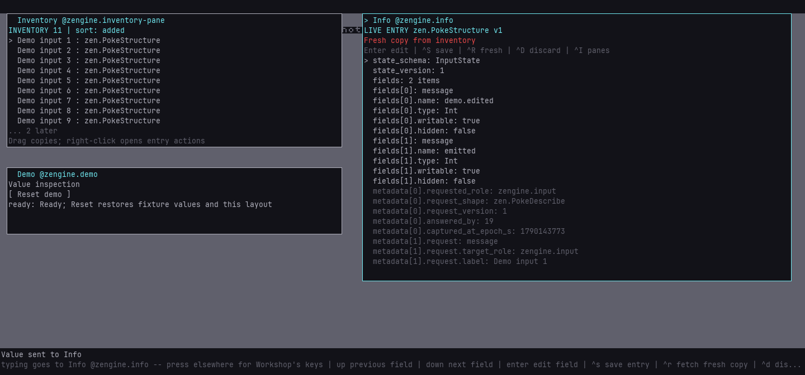
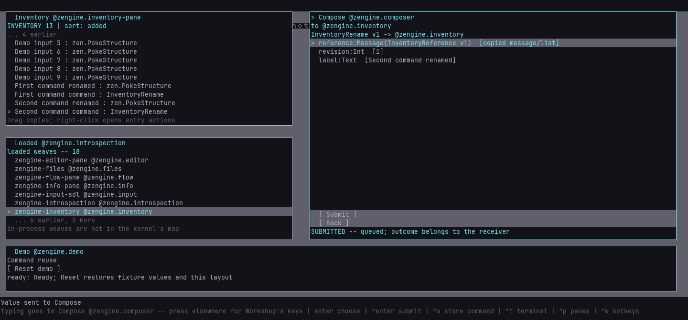

# Ready-to-use demo setups

Start a disposable Workshop, try a story, then press **Reset demo** and try again. These setups
reuse a Loom host and its Python service for the whole session. Your normal Workshop and its
saved startup files are separate.

| Setup | Starting desk | Try it |
|---|---|---|
| `values` | Inventory, Info, Demo | Drag an entry into Info, edit a scalar, save an independent copy, fetch it fresh |
| `commands` | Inventory, Loaded, Compose, Demo | Fill a command from an inventory reference, store it, drag it back and explicitly submit it |

Nine labelled entries contain captured descriptions of Input's state shape. They are ordinary
structured values: editing a copied field description does not change Input. Capture metadata
remains separate and read-only in Info. The [inventory reference](../reference/inventory.md)
explains their format; [Inventory to Compose](inventory-compose.md) explains the command story.





## Prepare once, reuse the running hosts

Prerequisites: a [built Zengine](../contributing/build-and-test.md), including Workshop, the
guest vocabulary and optional `zengine-demo-control` artifact; an installed Loom with
`loom-host`, `loom-runs` and the Python session runtime; Python 3.8 or later. Build and dependency
installation are separate from preparation. Run this from the Zengine source checkout:

```sh
python external-host/demo.py list
python external-host/demo.py start --root demo-runs/values --setup values --build build --loom-prefix ../Loom/build/_install
python external-host/demo.py status --root demo-runs/values
python external-host/demo.py reset --root demo-runs/values
python external-host/demo.py stop --root demo-runs/values
```

Substitute your configured build and installed prefix. `start` creates a **new** root directory;
it refuses to overwrite an existing directory lacking its demo record. The default is SDL. `--tui` instead uses the classic terminal medium, whose retained
cell picture can be inspected even when its output is redirected.
The chosen load plan must have its artifacts built. The result names the setup, state,
generation, session directory, root and elapsed milliseconds. `start` again with the same root
waits for the current preparation and preserves the running desk's work; it does not reset it.
`reset` is the separate explicit action. A different setup needs a different root.

The root contains explicit setup/session files, guest policy, both process logs and a durable
Loom session. The launcher checks the saved ELH lifetime before reusing it. After stopping, use a
new root to start again; retained evidence is never deleted or silently repurposed.

This is a local development harness. Invoking it authorizes the shipped Python package to run
in its dedicated host (`any-revision` trust), and creates a loopback credential with `input`,
`capture`, `inspect`, `inventory` and `demo` powers on its owned Workshop. It does not approve
access to another Workshop. Local package edits run as trusted code, not in a sandbox. For a
maker-controlled connection and narrower grants, use the [external-host guide](external-host.md).

## Reset and its boundary

The visible **Reset demo** button and `reset` command use the same persistent ELH recipe.
Reset restores the named layout, the nine recipe-owned values and labels, and Inventory's
selection plus Info's local draft or Compose's form. A removed fixture is recreated with a new
reference. User-created entries, including saved copies and commands, remain. Pending owner
operations refuse reset; the failed owner/step is reported. Completed earlier steps may remain
applied: this is not a transaction or undo of submitted commands, file writes or external effects.

The Info/Compose draft in this dedicated demo is intentionally disposable. Save a copy to
Inventory first if you want it to survive Reset. The controls show working, ready, failed or
unavailable. They depend on the ELH service: cancelling it makes Reset unavailable. An abruptly
killed or stuck service can leave work pending; its named run and logs identify the owner.
Stop the owned demo and use a fresh root if normal cancellation cannot recover it.

The launcher requests ordinary Workshop quit, observes disconnection, then shuts down the ELH.
If a pane refuses quit, it reports failure and leaves the processes available for inspection;
loss of an answer alone is not reported as successful exit.

## Run and repeat the stories

Use the returned session directory with Loom's `loom-session` command (or
`python -m loom_session` with the installed runtime on `PYTHONPATH`):

```sh
loom-session run demo-runs/values/session workshop/demo-values --name inspect-one
loom-session run demo-runs/values/session workshop/demo-reset-button --name button-one
loom-session run demo-runs/values/session workshop/demo-values --name inspect-two
```

For the command setup, run `workshop/inventory-compose-demo` with a fresh `label` each time;
previous commands are retained. `loom-session describe` supplies each tool's input syntax.
`workshop/demo-picture` captures a bitmap (or terminal cells) without taking an input session.
`workshop/demo-comfort` checks the default Inventory size with beginning/middle/end list views,
then restores the named demo. The tool package's
search terms include `demo`, `setup`, `reset` and `workspace`. Its descriptors explain required
authority, outputs and recovery. Script failures remain named runs, with their evidence.

## Measure the work behind one command

The launcher reports end-to-end invocation time. The persistent `demo-service` run writes
`setup.json`: fixture references and the latest 64 preparation samples, each with generation,
owner request counts by shape, outcomes, elapsed milliseconds and a result note. Unchanged fixture revisions skip redundant writes. Preparation
uses owner operations, without injected keyboard reset sequences or remote status polling.
Service work/finish requests, launcher status/reset requests, link admission and process startup
are additional costs; the per-preparation counter does not claim to include them.

Loom's run records own the tool asks and their answers. Screenshot transfer is separate work
and includes one request per chunk. Ask records have retention bounds: inspect `asks_dropped`
before treating a record as a total. Background and evidence traffic are not a story's setup cost.

The launcher enables `--demo-history --dump history.txt` on Workshop. This uses its existing Loom
Recorder, retaining up to 100,000 recent deliveries plus normal protected/last-call windows.
Timer/Drive traffic keeps only its latest call; payload retention remains off by default, with
the existing explicit build-output rules. The dump is written on orderly quit. It records bus
sequences and dispatch parents for causal analysis, and reports forgotten records. It is neither
a complete time trace nor proof that an absent chain did no work. Loom owns recorder semantics.

## Extend a recipe

`external-host/tools/workshop/demo_setup.py` owns the two layouts, fixtures and preparation.
Add story-specific setup there through ordinary state owners; the `demo-control` weave only
owns the button, work generation and result. Its service waits on one deferred work request.
Do not put test recipes or process-launch policy into Workshop.

`SetupApplyRequested v1` carries serialized `WorkshopSetup` text. Workshop validates before
replacing the active layout and refuses unresolved/waiting panes or an open menu. It clears
selection, detaches the saved-layout association, applies the setup and answers `zen.Ack`.
It neither writes a setup file nor resets provider state. `PaneResetRequested v1` names a pane;
Info, Compose and Inventory implement their own transient-state reset and refuse pending work.
The separate `demo` guest power grants these specific owner doors and the demo service protocol.

These recipes are early workspace candidates. They do not provide arbitrary-session isolation,
general persistence, undo, process supervision or a workspace framework.
