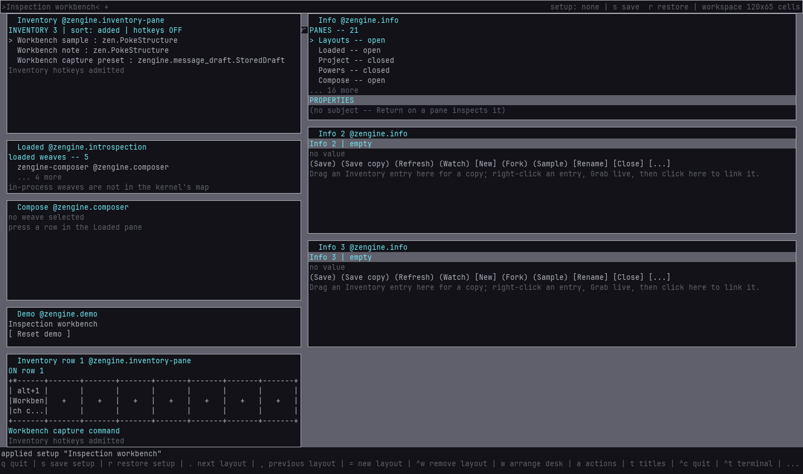
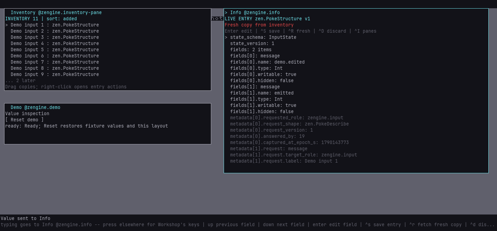
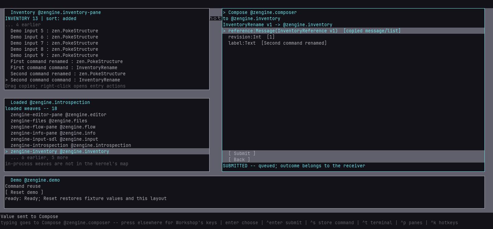

# Ready-to-use setups

One command prepares a dedicated Workshop for a task -- its panes, arrangement, starting material,
toolbox and hotkeys -- and waits until it is usable. Run it again to come back to the same desk;
press **Reset demo** to return it to its starting condition. Each setup reuses one Loom host and
its Python service for the whole instance. Your normal Workshop and its saved files are separate.

| Setup | Starting desk | Try it |
|---|---|---|
| `values` | Inventory, Info, Demo | Drag an entry into Info, edit a scalar, save an independent copy, fetch it fresh |
| `commands` | Inventory, Loaded, Compose, Demo | Fill a command from an inventory reference, store it, drag it back and explicitly submit it |
| `presets` | Inventory, Loaded, Info, Compose, Demo | Unset a saved command field, reopen the partial preset, and fill it from a typed record |
| `workbench` | Inventory, Loaded, Compose, three Info views, a hotkey row, Demo | The [inspection workbench](info-views.md#the-inspection-workbench) filled and ready; **Alt+1** captures Input's state into Inventory |
| `folders` | Inventory, three Info views, Demo | The [organized workbench](inventory-folders.md#the-organized-workbench), restored by its story |
| `editor-materials` | Editor, Inventory, Files, Terminal, Demo | Carry a selection, a Terminal command and a file place into named folders, save a toolbox, and bring them back in another Workshop ([carrying](editor.md#carrying-text-commands-and-file-places)) |
| `tower-defense` | Editor, Files, Builder, the game, Inventory, a hotkey row, Demo | The [tower defense example](../../examples/tower-defense/README.md#a-ready-development-desk) built and loaded; **Alt+1..Alt+5** run its game commands |







## Find a setup

```sh
python external-host/demo.py list
python external-host/demo.py describe tower-defense
python external-host/demo.py describe workbench --json
```

`list` names every setup; `describe` says what task it supports, when to choose it, what it
prepares, its prerequisites and the authority its guest is given, its hotkeys, a first task with
the result to expect, what Reset restores and keeps, and where its guide is. `--json` prints the
same description for a program. Describing reads files only: it starts nothing and grants nothing.

## Prepare once, come back to it

Prerequisites: a [built Zengine](../contributing/build-and-test.md), including Workshop, the guest
vocabulary and the `zengine-demo-control` artifact; an installed Loom with `loom-host`,
`loom-runs` and the Python session runtime; Python 3.8 or later. A setup may name more
(`tower-defense` also needs an installed Zengine prefix); `describe` lists them. Build and
installation stay separate from preparation. Run from the Zengine source checkout:

```sh
python external-host/demo.py start --setup workbench --root demo-runs/workbench --build build --loom-prefix ../Loom/build/_install
python external-host/demo.py status --root demo-runs/workbench
python external-host/demo.py reset --root demo-runs/workbench
python external-host/demo.py stop --root demo-runs/workbench
```

Substitute your build tree and installed prefix. A missing prerequisite is named, with the flag or
build step that supplies it, before anything starts. `start` makes a **new** root: Workshop, its
guest file, a Loom session and the setup's preparation service. It returns once the service says
the setup is ready -- every desk pane described by Workshop, every declared entry present, every
declared hotkey read back ON -- with the first task, the hotkeys, the guide's path and the
preparation's own request counts. The default medium is SDL; `--tui` uses the classic terminal
medium, whose retained cell picture can be inspected when output is redirected. A setup names
the media it supports and refuses the others by name.

What each answer means, and what to do:

| `start` or `status` says | meaning | next |
|---|---|---|
| `ready` | usable as described | the first task |
| `failed` | an owner refused; the note quotes it and names the step reached | read the note; fix, then `reset` or a new root |
| `pending` | not ready within `--wait` seconds (900 by default); preparation goes on | `status --root R --wait 300` waits again |
| `lost` | the recorded Loom session does not answer | nothing is stopped or removed; close the Workshop window yourself, start a new root |
| `description_changed` beside the state | the setup's files changed since this root prepared it | the root keeps the revision it prepared, and Reset restores that revision; a new root uses the change |

`start` again with the same root returns to the running desk: it waits for any preparation in
progress and changes nothing, so your work stays. It refuses a different setup (use another root),
a stopped root, and a root whose start was interrupted before it recorded its instance --
`launch.json` there names the processes that start began, and nothing is stopped or reused.

The root keeps the setup's files, the guest policy, both process logs, the Loom session and, for a
setup with a project, `project/` and a development runtime. `start` first copies the setup, as
`export` does, into `prepared/<name>/` in the root: the desk, toolbox, project files and tool
packages come from that copy, so the root prepares -- and every Reset restores -- the revision it
started with, whatever later happens to the setup's own directory. `stop` asks Workshop to quit, sees the
link close, then ends the Loom session; if a pane refuses quit it says so and leaves both running.
A stopped root is evidence: start again in a new one.

This is a local development harness. Starting a setup authorizes the shipped Python packages it
names to run in its dedicated host (`any-revision` trust) and creates a loopback credential with
exactly the powers its description lists, on its own Workshop -- for most setups `input`,
`capture`, `inspect`, `inventory`, `toolbox`, `demo` and `open`. It approves nothing on another
Workshop. Local package edits run as trusted code, not in a sandbox. For a weaver-controlled
connection and narrower grants, use the [external-host guide](external-host.md).

## Reset and its boundary

The visible **Reset demo** button and the `reset` command run the same preparation again. Each
setup's description says what Reset restores and what it keeps (`describe` shows both). In
general it re-applies the setup's layout, clears the transient state of the Info, Compose and
Inventory panes on its desk, returns each entry the setup owns -- its captured values or the
entries its toolbox brought -- to its starting value, label and folder, puts each declared hotkey
view back as declared, and repeats the setup's starting steps. Entries you created, including
saved copies and stored commands, remain; files and built artifacts are not touched.

A hotkey view the setup declares is the setup's own: the view it made, or the one its toolbox
brought, sitting in the setup's view slot on the desk. Reset puts exactly the declared commands
back in it, in declared order, with their declared chords, and turns that view and those items ON.
Anything else you put in it goes back to main Inventory, unchanged. If you moved a declared command
into a view of yours, Reset takes the command back and leaves your view, its other entries and its
switch as they are. A removed owned command is recreated with a new reference; Inventory keeps the
removed entry's tile (`[unavailable]`) and its key where it was, so Reset turns that old view OFF,
leaves it in Inventory's views, and gives the command a fresh view in the same slot. Between
resets, move things as you like: `start` on the running root does not undo it.

Pending owner operations refuse Reset; the failure names the owner and the step reached. Steps
completed before it stay applied: this is not a transaction or undo of submitted commands, file
writes or external effects. The Info and Compose drafts on a setup's desk are disposable: save a
copy to Inventory first if you want it to survive Reset. The controls show working, ready, failed
or unavailable, and depend on the preparation service: cancelling it makes Reset unavailable.

## Hotkeys a setup turns on

Restoring a toolbox leaves every binding OFF. A setup that declares hotkeys asks Inventory's own
configuration door, as its explicit preparation, to place each command in the setup's own view,
bind the declared chord and target, enable the item and turn that view's context ON; it then reads
them back and checks that Workshop presents the view on the desk. It turns on no other view.
`describe` lists each chord, its command, its target office and what it means. A command still
runs only with the pressing actor's permission, checked when the key is pressed: the setup's guest
is judged by its own grant, a person's hand by theirs.

Inventory judges every edit by the keys it would leave live, so preparation first switches off each
of its commands that is still ON but not yet in its own view with its declared chord and target,
then places and binds them, and only then switches them and their view ON. A rearrangement of yours
-- the command rebound to Alt+2 in a view that is OFF, beside your own live Alt+2 -- therefore
comes back without meeting a key only a halfway state would have had. Inventory still refuses a
chord that another ON view holds in the finished arrangement: preparation reports that refusal,
naming where the chord is ON, never claims ready over it, and leaves your command its key; the
setup's key stays OFF -- its command or its view switched off, as `status` says -- until a Reset
completes. A
repeated preparation binds nothing twice. Turn a key off with the tile's **Disable item hotkey** or
the view's **Turn this view's hotkeys OFF**; Reset turns it back on.

## Run and repeat the stories

Use the returned session directory with Loom's `loom-session` command (or
`python -m loom_session` with the installed runtime on `PYTHONPATH`):

```sh
loom-session run demo-runs/values/session workshop/demo-values --name inspect-one --wait 120
loom-session run demo-runs/values/session workshop/demo-reset-button --name button-one --wait 120
loom-session run demo-runs/values/session workshop/demo-values --name inspect-two --wait 120
```

All three drive the one Info pane and the middle one presses Reset, so each waits for the one
before it; without `--wait` they would overlap ([why](info-views.md#the-inspection-workbench)).

For the command setup, run `workshop/inventory-compose-demo` with a fresh `label` each time;
previous commands are retained. The `presets` setup uses `workshop/inventory-preset-demo`,
also with a fresh `label`. It saves a blank template, complete command and incomplete preset,
and captures the incomplete/reviewed state. Both editors reset; all user-created entries survive. `loom-session describe` supplies each tool's input syntax.
The `editor-materials` setup uses `workshop/editor-materials-demo`, whose `folder` is the demo
root's `workshop/materials` (it writes `beat.cpp` and `notes.txt` there) and whose `toolbox` is a
file path. `phase=prepare` is the pointer story -- a timed sweep, a Bezier drag from the highlight,
right-click Extract, `Ctrl`+`l`, a real Terminal command filed and dropped back as C++ and as its
line, a location refused over unsaved work and then reopened -- and saves the toolbox.
`phase=retrieve`, in a new root started after the first one stopped, restores that toolbox and
brings the place and the snippet back. `phase=keyboard` is the terminal medium's route (start
with `--tui`). Start with `--neovim <program>` and the Neovim-backed Editor holds the office from
the start; `phase=neovim` then carries a Visual selection out and a stored copy back in, and
shows a change Neovim holds: a command's line chosen while Neovim waits for input is said to
wait, and goes in when Escape ends the wait ([when Neovim is waiting](neovim.md#carrying-text-commands-and-file-places)).

```sh
loom-session run demo-runs/materials/session workshop/editor-materials-demo --name prepare --input phase=prepare --input label=Beat --input folder=<root>/workshop/materials --input toolbox=<root>/editor-materials.toolbox --wait 600
```

`workshop/demo-picture` captures a bitmap (or terminal cells) without taking an input session.
`workshop/demo-comfort` checks the default Inventory size with beginning/middle/end list views,
then restores the named demo. The tool package's
search terms include `demo`, `setup`, `reset` and `workspace`. Its descriptors explain required
authority, outputs and recovery. Script failures remain named runs, with their evidence.

## Measure the work behind one command

`start`, `reset` and `status` report end-to-end milliseconds and the latest preparation sample.
The persistent `demo-service` run writes `setup.json`: the setup's owned entries and the latest
64 preparation samples, each with generation, the step reached, owner request counts by shape,
outcomes, elapsed milliseconds and a result note. Unchanged fixture revisions skip redundant
writes. Preparation uses owner operations; injected input is used only for a setup's declared
starting steps and for pressing a Builder key. Service work/finish requests, launcher
status/reset requests, link admission and process startup are additional costs; the
per-preparation counter does not claim to include them.

Loom's run records own the tool asks and their answers. Screenshot transfer is separate work
and includes one request per chunk. Ask records have retention bounds: inspect `asks_dropped`
before treating a record as a total. Background and evidence traffic are not a story's setup cost.

The launcher enables `--demo-history --dump history.txt` on Workshop. This uses its existing Loom
Recorder, retaining up to 100,000 recent deliveries plus normal protected/last-call windows.
Timer/Drive traffic keeps only its latest call; payload retention remains off by default, with
the existing explicit build-output rules. The dump is written on orderly quit. It records bus
sequences and dispatch parents for causal analysis, and reports forgotten records. It is neither
a complete time trace nor proof that an absent chain did no work. Loom owns recorder semantics.

## Author a setup

A setup is a directory. Adding one is adding a directory -- no launcher or service code changes:

| file | holds |
|---|---|
| `setup.json` | the description below |
| a desk | Workshop's own setup file (`WorkshopSetup`, what `s` writes), holding the `zengine.demo` controls pane |
| a guide | how to use it: first task, hotkeys, reset and limits, with the pictures it shows |
| the assets it names | a toolbox, project files and a recipe template, a Loom tool package |

Ordinary setups live in the tool package's `setups/` directory (`external-host/tools/workshop/setups/`,
installed with the package); an example's setup lives beside the example (`examples/<name>/setup.json`);
`--setup` also takes any directory holding `setup.json`. [`workbench`](../../external-host/tools/workshop/setups/workbench/setup.json)
and [`tower-defense`](../../examples/tower-defense/setup.json) are the two complete examples.

`setup.json` (`format` `zengine-setup`, `format_version` `1`) says, for a reader: `title`,
`summary`, `task`, `choose`, `prepares`, `guide`, `first_task` (`do`, `expect`), `variations`,
`limits`, `reset` (`scope`, `keeps`); and for preparation:

- `medium` -- the `supports` list (`sdl`, `tui`) and the `viewport` in cells;
- `requires` -- extra `artifacts`, named `inputs` (such as `zengine_prefix`, a launcher flag) and
  `notes`;
- `authority` -- the guest's `may` powers (always `demo`) and what it may `observe`;
- `desk` and `view_slots` -- the desk file, and places for portable Inventory views that exist
  only once material creates them (Workshop refuses a desk naming a missing view): slot *i* holds
  the *i*-th declared hotkey view, and a slot beyond them the next other view holding entries
  (how the `folders` story's view is seated);
- `material` -- `{"capture": {"target_role", "labels"}}` or `{"toolbox": <file>}`: the entries the
  setup owns; a toolbox is restored once, into an empty collection;
- `hotkeys` -- `key`, `entry` (an owned entry's label), `target` office, `view` (`row`,
  `column` or `single`; hotkeys naming one kind share one view, and each view needs a slot),
  `means`;
- `project` -- `files` to copy (`{"target": "source"}`; a target is a path inside the project,
  such as `src/game/td.cpp`, whose directories are made; not absolute, no `..`, and not the
  launcher's own `build-recipes.json`), a `recipes` template whose `${zengine_prefix}`,
  `${loom_prefix}`, `${build}` and `${root}` the launcher fills, `plan` rows appended last to the
  load plan, and `runtime: development` to run from a copy of the build;
- `providers` -- an office the setup builds (`prepare: build`): when Workshop refuses the desk
  naming that office's pane, preparation arranges the rest, builds the project frontier through
  the Builder, and arranges the desk again;
- `guide_files` -- files or directories the guide shows or links to (its pictures), inside the
  setup's directory beside a guide that is too, so a copy keeps them where the guide points;
- `tools` -- Loom tool packages the session approves beside `workshop`;
- `starting` -- [`workshop/act`](external-host.md#3-from-a-loom-session-journeys-as-python-tools)
  steps run after the desk is ready and on every Reset (a new game, say).

Asset paths are relative to the setup's directory and never absolute; they may reach shared
material with `..`. `python external-host/demo.py export --setup NAME --to DIR` copies the
description and every declared asset into one new directory, rewriting each reference to its
copy, and `start --setup DIR` uses it from there. A reference inside the setup keeps its path; one
reaching out with `..` takes the path after its `..` parts, and when another file already holds
that name -- or a case variant of it, or a file stands where its directory would go -- its first
part is numbered (`../shared/code.cpp` beside the setup's own `shared/code.cpp` becomes
`shared-2/code.cpp`). One source named twice is copied once. `export` prints where each reference
went (`placed`). It builds the copy in `DIR.partial`, checks every file against what it read, and
only then renames it to `DIR`; a failure removes the partial copy and says why, and a `.partial`
left by an interrupted export is named and must be removed before exporting there again. A description holds no credential, live
reference, process id or machine path: those belong to an instance's root.

A weaver reads the guide from that copy -- `start` names the guide in `prepared/<name>/` -- where
nothing outside the setup's declared files exists. So a guide links to its own pictures and files by
their paths in the setup (declared in `guide_files`), and to any other page of this repository by
its published address, `https://github.com/Krealsion/Zengine/blob/main/<path>#<heading>`, never by a
path back into the source tree. `demo_recipes` exports every shipped setup outside the repository
and resolves each guide link there, and each published link against this checkout's files and
headings.

`SetupApplyRequested v1` carries serialized `WorkshopSetup` text. Workshop validates before
replacing the active layout and refuses an unresolved pane (naming the first one), a pane waiting
for room, or an open menu. It clears selection, detaches the saved-layout association, applies the
setup and answers `zen.Ack`. It neither writes a setup file nor resets provider state.
`PaneResetRequested v1` names a pane; Info, Compose and Inventory implement their own
transient-state reset and refuse pending work. The separate `demo` guest power grants these
specific owner doors and the demo service protocol; the `demo-control` weave owns only the button,
the work generation and the result.

These setups are workspace candidates for dedicated instances. They do not provide arbitrary-session
isolation, capture of a live workspace, general persistence, undo, process supervision or a
workflow language.
