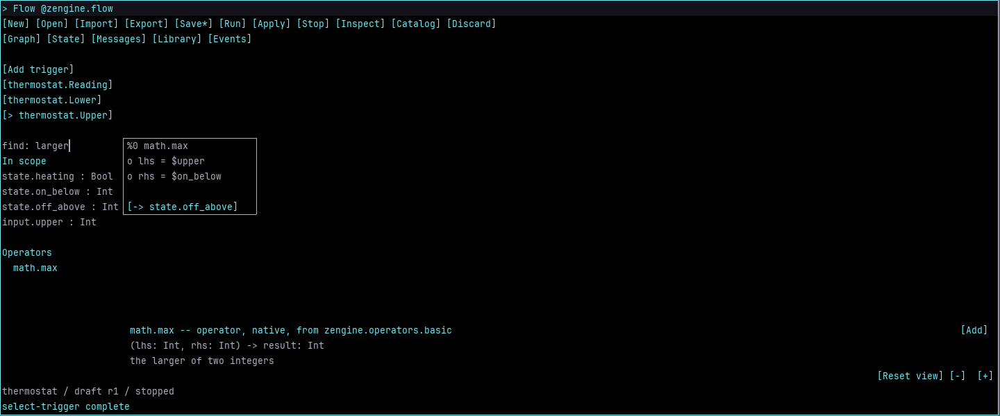
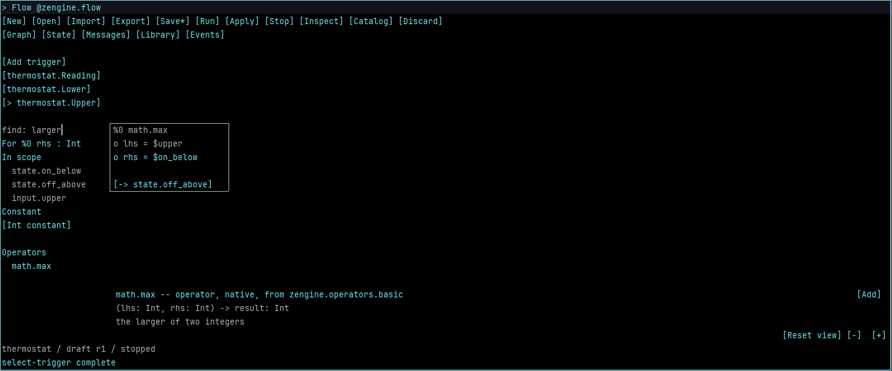
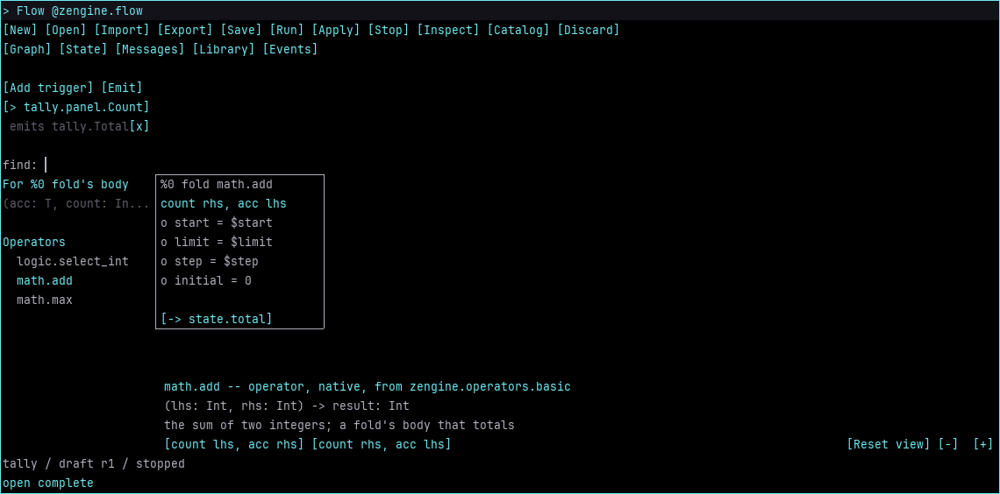
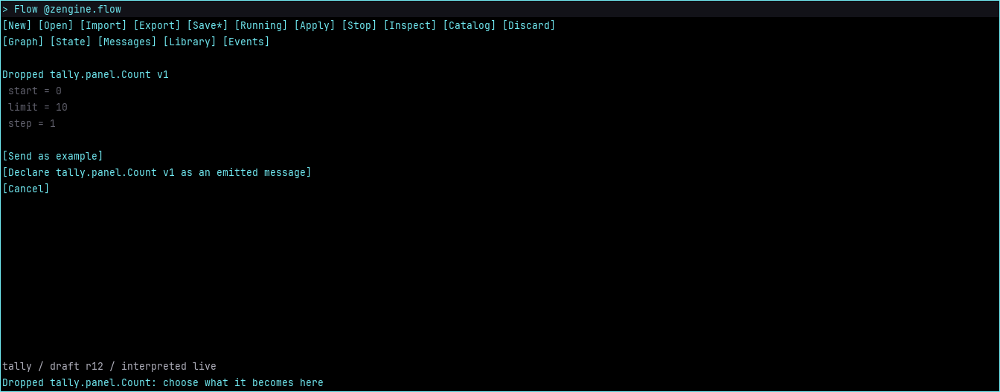
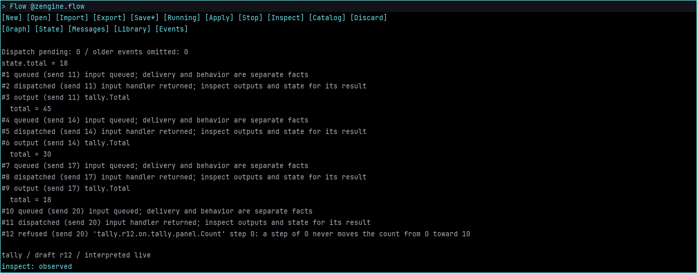
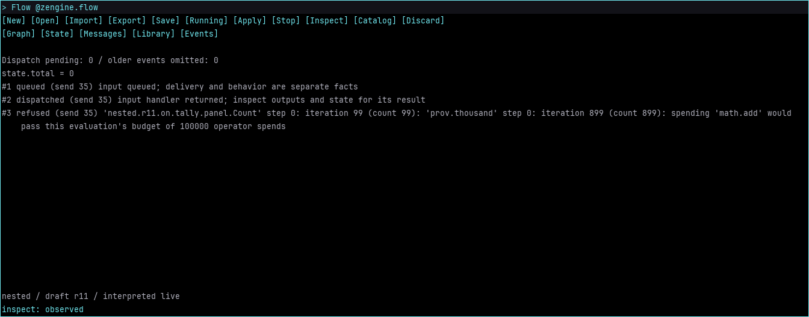
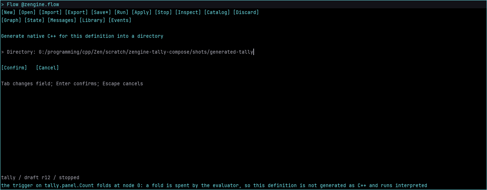

# Author a running graph in Workshop

Flow is a replaceable pane for creating message-driven weaves from the operators available in
the current host. The graph edits a draft. **Run** creates an interpreted participant; **Apply**
changes its behavior while keeping compatible live state. A rejected edit leaves it running.

Build and launch [development Workshop](develop-workshop.md), open Pane Manager, and choose
**Flow**. The shipped plans include the optional `zengine-flow-pane` artifact in the `zengine.flow`
office. Enlarge its pane for the graph; room for roughly 100 text columns is comfortable. A host
without the optional canvas protocol receives a textual summary. The independent
[Flow workbench](../guides/flow.md) remains available without Workshop.

## Create a high-water tracker

1. Choose **New**, name the project `water`, and confirm. The dialog states that it replaces the
   current draft. Save existing work first. Stop an existing run before opening another project.
2. Open **State**, choose **Add state field**, and declare `value`, `Int`, `required`. Its initial
   value is zero. Click a value to edit it; **Keep state** installs the completed form as initial
   or saved state. Editing an initial-state form does not change a running participant.
3. Open **Messages**, choose **New message**, and name it `Reading`. Choose **Add field** for
   message index `0`, name `input`, kind `Int`, presence `required`.
4. Open **Graph**, choose **Add trigger**, select message index `0` and state output `value`.
   Type `larger` (the search line beside the graph takes what you type) and click `math.max`
   under **Operators**. The strip beneath the graph previews it: what it is and whose, its
   signature, and what its contributor says it is for. Choose **Add**.
5. Click `input.input` under **In scope**, then the node's `lhs` port. Click the `rhs` port: the
   rail lists what could fill it ([below](#find-what-to-compose)). Click `state.value` there.
   The graph executes in order; forward or cyclic connections are refused.
6. Select the node header and choose **Use as result**. Drag its header to move it. Drag blank
   graph room or use the middle button to pan; the wheel pans vertically over the graph.
   The **-** and **+** controls change node positions and widths from 50% to 200%, in 25% steps.
   Text and port-row height stay fixed at the host's measured text size. SDL uses the normal
   Workshop font over Flow's black background; the terminal uses its cell grid. Dragging and panning
   use those same measurements. Saved layouts keep their authored coordinates when the font
   or medium changes. Layout changes do not change executable behavior.
7. Choose **Run**. An unwired port or incompatible type names the place to repair. **Run queued**
   means a request was queued; the host's later answer establishes whether the participant exists.

In a dialog, **Tab** selects the next field, **Ctrl+A** selects its text, **Enter** confirms,
and **Escape** cancels. Enter is the pane's `dialog-confirm` row while a dialog is open, so it
moves in your keymap like any pane's row. A refused confirmation keeps the entered text for
correction. A dialog that writes a file -- Save, Export, Generate native C++, the library's save --
asks Workshop on confirm whether the confirming hand may write one, and writes nothing and keeps
the dialog until it is answered; a confirm that reaches Flow as a raw key, before that row is in
force or after it has moved, asks nothing and says to confirm with the row. On a
[weaver's host](external-host.md#whose-host-this-is-and-what-each-power-reaches-there) a guest's
is refused. Confirm or cancel before changing pages, starting another edit, or quitting.

## Find what to compose

The rail beside the graph finds operators through the host's
[discovery door](../reference/introspection.md#the-discovery-door-finding-a-power), the door the
**Powers** pane and the Terminal ask too, so one question gets the same rows in all three.

- **The search line** takes what you type while no dialog is open. A power matches when each word
  appears in its name or in what its contributor says it is for. The rows come in the catalog's
  order, grouped as **Forms**, **Sources**, **Operators** and **Conversions**, and a count says how
  many more matched than one answer carries. **Forms** holds the fold, found by what it is for:
  type `count` or `total`.
- **A selected port** narrows the search to what yields its type, and lists before that what is
  **In scope** of the type (state and message fields, and earlier nodes' outputs), then a typed
  constant for an `Int` or `Bool` port. An in-scope row wires the port; the constant opens the
  binding editor. Click the port again to put it down.
- **A row previews; it never runs.** A form and an operator that share a name are two rows, and
  each previews and adds itself. The preview is the door's row, and showing it evaluates
  nothing. **Add**, or **Enter**, adds the previewed power at the end of the trigger's graph, by
  the reference the row carries; if its ports have changed since it was found, Add says so and
  adds nothing, and so it does when the graph changed while Flow read those ports from the host.
  With a node selected, **Add before %n** places it ahead of that node instead, and
  with a port selected, **Add into %n port** places it ahead of the port's node and wires it there,
  so a found operator can feed the port you were filling. The graph executes in order, and the
  nodes that follow are renumbered.
- **A fold** runs an operator once for each count from a start toward a limit by a step,
  threading an accumulator. Add it from **Forms**: it arrives with `step` bound to `1`. Click its
  `body = [choose]` row: the rail then lists only what a fold could spend -- one answer, an `Int`
  port for the count and another port of the answer's type -- and the preview offers each way to
  thread it, such as **count rhs, acc lhs** for `math.add`. You choose which port takes the count;
  port names only suggest. The node then reads `fold math.add`, its body row `count rhs, acc lhs`,
  and it is brought into view whole. A reference the slot refuses is put down, so choosing again
  spends the row the door holds now. Wire `start`, `limit`, `step` and `initial`, and any other port of the
  body from scope.
- **What Flow does not offer.** A running definition's trigger body is that participant's own
  reaction, mounted for one revision and gone at the next behaviour edit. Flow asks only for
  powers their contributors offer, so it never lists one; **Powers** lists it and says it is not
  offered.

**Escape** sheds one layer per press: the wire in hand, the selected port, an open body slot,
the preview, the selected node, then the search line, and only then is the pane put down. **Delete** removes the
selected node; with none selected, it edits the search line.

## Carry material into Flow

Drag a value from Inventory, Info or Powers onto Flow, or pick it up with the keyboard and click
Flow, and Flow says what it can be here. Carrying copies data; it grants nothing.

- **An operator reference** -- a power dragged out of **Powers**, or one Inventory keeps --
  becomes a node: into the port it lands on, ahead of that port's node; as the body of a fold
  whose `body` row it lands on, the slot opening with it found so you choose the count's port; or
  anywhere else on the graph, at the end of the trigger, where you released it. A reference whose
  operator's ports have changed since it was found is refused with that sentence.
- **Any other value** opens a page of offers: **Send as example** when this definition accepts
  its shape and the participant is running; **Use field = value on %n port** for each field of
  the port's kind when it landed on an `Int` or `Bool` port; **Declare ... as an accepted
  message** when no message of its name is declared, and **as an emitted message** when its name
  is inside the definition's namespace. A dropped shape description -- a carried shape, which
  holds the shapes it nests and is what Flow and the View Builder carry, or a bare
  `zen.SchemaDesc` -- offers the declarations of the shape it describes; a carried shape's page
  names that shape, what it nests and each field's type. A description naming a shape it does
  not carry offers no declaration, and its page says why in Loom's words (`Not declarable: ...`). A declared shape is the one that came -- its name,
  version and fields -- so values of it match it exactly. **Cancel** or **Escape** puts it down,
  and so do **New**, **Open** and **Import**, since its offers belong to the graph it landed on.

**Carry a shape out of Flow.** In **Messages**, drag a declared message -- an accepted one, or
one under **Emitted** -- and let go over the pane it goes to; or right-press it, choose **Carry**,
then click that pane. What travels is the message's shape, as a description: the
[View Builder](view-builder.md) takes it onto a label as what that label shows.

## Say what changed: emits

A definition publishes messages of its own after a trigger writes its state field. In
**Messages**, **New emitted** declares one -- a name without a dot is put in the definition's
namespace, and a name outside it is refused, so a definition can only speak for itself -- and
**Add emitted field** gives it fields. On the graph, **Emit** (beside **Add trigger**) publishes
one after the active trigger's write: the dialog fills each field from the state field of its
name, `total=$total`, and you may write any field from another state field or a constant instead.
The active trigger lists what it emits, each with **x** to remove it. An emit is a publication by
this participant, of its own shapes, after every successful write; there is no conditional emit
and no addressed send. A new emitted shape changes what a running participant may say, so
**Stop** and **Run** it again rather than **Apply**; **Events** then shows each publication and
its fields.

A fold counts at most <!-- value kMaxFoldCount -->10000<!-- /value --> times, and one evaluation
spends at most <!-- value kEvaluationSpends -->100000<!-- /value --> operators and nests at most
<!-- value kEvaluationDepth -->32<!-- /value --> deep, however its folds and calls are arranged;
past any of these the send is refused, the refusal naming each fold's iteration on the way down,
and the state is left as it was.

## Keep examples and exercise the weave

In **Messages**, open `water.Reading`, click `input`, enter `3`, and confirm. **Save example**
stores this as `low`. Change the field to `7` and save `high`. These values are reusable data;
they carry their schemas and no sender identity, destination, grants or reply provenance.

Choose **Send**, then **Events**. The current exposed state and observed outputs/refusals appear
with send correlations; a long one, such as a refusal in its owner's words, continues on the rows
beneath it. Dispatch settlement is distinct from an application result; a quiet weave
does not promise a reply. **Inspect** refreshes the owner's bounded record. An omission count says
when older observations were dropped. Loom's host Recorder/Logger remain the broader history tools.

Open `low` in **Library** and send it. The high-water state remains `7`. Return to Graph, click
the `rhs` port, choose **Int constant** and bind `10`. Choose **Apply**, then send `low` again: the state now
becomes `10`. Apply preserves live state and requires the existing accepted/emitted/state contract.
A schema change needs an explicit stop and fresh run; this pane does not invent a migration policy.

## Save unfinished work and return to it

**Save** writes one workspace containing the definition draft, node positions, view, named examples,
retained forms and saved state. Empty triggers and unwired ports can be saved. Forms preserve
absence, empty text and `false` separately. Missing required fields prevent sending, not saving.
Opening a changed schema retains the previous form under its previous identity. **Library** also
shows retained forms, including those historical shapes.

Click an absent Message or List field to create it. Clicking a present list appends an item;
its nested fields become editable rows. A present Message keeps its existing contents. **unset**
removes a value deliberately. The message-draft C++ API supports structured paths for list
removal; `FlowEdit` exposes `list-erase(row,index)` for the open form.
Scalar forms use Loom's existing schema-directed composer. Bytes currently require a typed API
value; the text editor does not invent a hexadecimal or base64 spelling.

**Library / Export** and **Import** share named values independently of a Flow project. Reopening
and sending checks schema agreement; an older example is not automatically migrated. The workspace
and library each have a 1 MiB file limit. Saves use the existing atomic file replacement helper.

After execution, newly observed state becomes the saved state unless an explicit initial-state
edit is awaiting a fresh run. The Events page continues to show live state independently. Saving
does not save process identity, pending queues, grants or resumable native continuations.

**Export** writes a completed executable Flow project for the standalone workbench and its C++
generation path. **Import** brings such a project into this editor. **Ctrl+G**, Generate native C++,
writes the generated project -- `generated.cpp`, its CMake file, `definition.bin` and
`graph.svg` -- into a directory, as the workbench's `generate` does; a definition with a fold is
refused in words and nothing is written, because the fold is the evaluator's and runs
interpreted. Workspace files additionally contain unfinished authoring work and presentation;
they are not executable projects.

An orderly Workshop quit is refused while host work or its fresh state inspection is pending.
Try quitting again after the result arrives. Saving an older snapshot while a send is pending
does not bypass that refusal. Save unsaved Flow work, or choose **Discard** and type `discard`
to allow closing without saving. Pane reload restores the workspace and reconnects to
the session through its office. The selected page, unconfirmed dialog text and selection, and
the distinction between a deliberate initial-state edit and observed live state also survive
reload. Unconfirmed dialog text is separate from a saved workspace. Drawing grants and hit maps
are reacquired; a held drag ends rather than resuming in the replacement pane.

## Other interfaces

`FlowEdit` addresses `zengine.flow` with an action and a list of separate string arguments. The
`describe` action summarizes the editing grammar; `FlowEdited` returns acceptance, the workspace
and diagnostics. While a dialog is open, all `FlowEdit` requests are refused, including
`describe`; confirm or cancel the dialog through the pane first. A successful runtime command
means it was queued, with its later outcome shown in the pane. The
[Flow reference](../reference/flow.md#workshop-control-and-reload) describes this boundary.
This is the same semantic editing model the controls use. It is not a shell command.
Runtime requests have their own [Flow host protocol](../reference/flow-runtime.md), with explicit
ownership and authority. [Reusable message drafts](../reference/message-drafts.md) are available
as a package independently of this pane. The [canvas protocol](../reference/workshop-panes.md)
belongs to any pane that needs bounded local drawing.

Graphical editing uses rectangular nodes, orthogonal wires and measured one-line text. Dialog
carets and selections use the host's text presentation. Bytes outside printable ASCII appear as
`?`; this display substitution does not rewrite stored values. An ellipsis marks text shortened
to fit. Large offscreen graphs do not consume the visible canvas budget. If the visible drawing
itself exceeds that budget, Flow shows **View
limit reached** with save/export and zoom controls. Pan or zoom in to reduce visible content;
the underlying draft remains intact.

The pane exposes input/state schemas and existing trigger graphs; arbitrary C++ deconstruction, authored
schema migration, general replay, and a visual emission-mapping editor remain separate capabilities.

The complete workspace is bounded to 1 MiB, including its retained forms and library.
An edit that would exceed this bound is refused before replacing the current draft, so
reload and save retain the same guarantee. Export reusable examples to a separate library
and remove unneeded presets before growing a workspace further.
