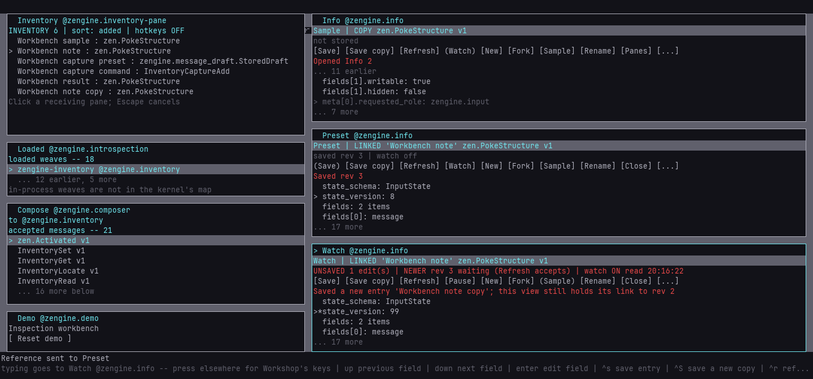
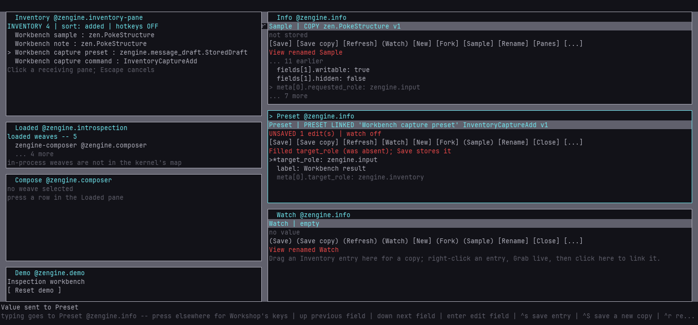
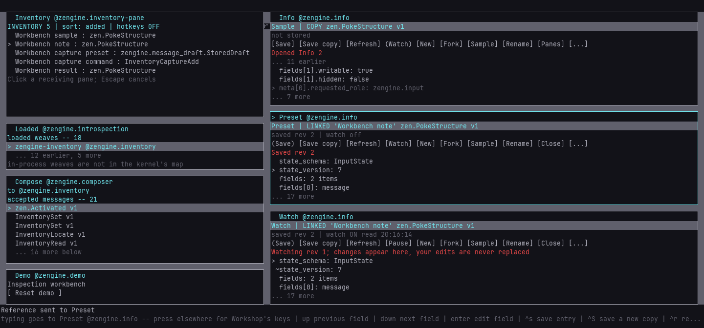
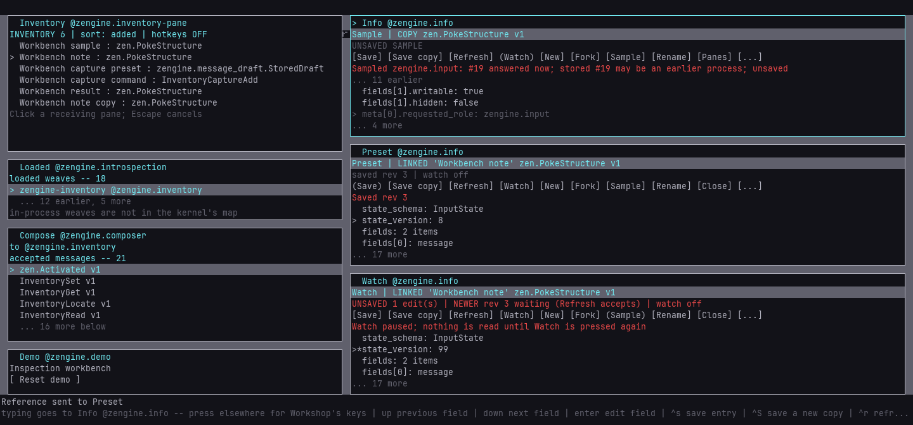

# Independent Info views and the inspection workbench

Keep several typed values open at once: a captured sample in one Info view, an incomplete command
preset in a second, a watched note in a third. Each view holds its own subject, draft, selection
and pending work, so changing focus or using another pane never replaces what a view shows.



## Open, name and close views

Info has four views: the default **Info** pane, which still inspects pane properties, and three
value views, **Info 2**..**Info 4**. Press **[New]** in any value view, or **Ctrl+N** in Info's
pane-property view, to open the next unused one. **[Fork]** (Ctrl+Shift+N) opens another view with
a copy of this view's local draft: nothing is stored in Inventory, and no pending request, watch
or sample travels with it. A forked linked draft stays linked to the same entry; its saves are
still conditional on the revision it was read at.

**[Rename]** (Ctrl+M) names the view. The name belongs to the view, never to the stored entry; it
leads the view's first row, and for Info 2..4 the pane header and Pane Manager too (the default
pane keeps its name there). **[Close]** (Ctrl+Shift+W) retires a view and takes it
off the desk:

- Unsaved edits, or a pending read or sample, need a second **[Close]**; the notice says what
  would be discarded. A save waiting for its answer refuses Close until it is answered.
- Closing never deletes Inventory data. A retired view's late answers are ignored, and the next
  **[New]** reuses its slot with nothing carried over.
- Closing a pane from the desk or the Pane Manager only **hides** it: its draft stays, and the
  Pane Manager reopens it. A hidden view never watches.

The four panes are offered on first use and then reused, so opening and closing views never grows
Workshop's pane catalog. When all four are in use, **[New]** says so and names any hidden ones.

## Read a view

```text
Watch | LINKED 'Workbench note' zen.PokeStructure v1         title | mode, entry name, schema
UNSAVED 1 edit(s) | NEWER rev 3 waiting (Refresh accepts) | watch ON read 20:05:10
[Save] [Save copy] [Refresh] [Pause] [New] [Fork] (Sample) [Rename] [Close] [...]
Saved a new entry 'Workbench note copy'; this view still holds its link to rev 2
entry 3f2a9c1e rev 2 | last watch attempt ...                  detail, in taller rooms
>*state_version: 99                                            > selected, * your edit
 ~fields[0].name: pumped                                       ~ changed by an observation
```

- **COPY** holds an independent value; **LINKED** edits one Inventory entry, and saves check the
  revision it was read at. **PRESET** marks an unfinished command draft. **LINK STALE** means the
  entry is gone (removed, or a toolbox restore rotated Inventory's identity); the draft stays.
- A control in brackets acts; one in parentheses is unavailable, and pressing it says why.
  **[...]**, Ctrl+Period or a right-click opens a menu with every action, including Discard,
  Make preset, Unset and Pick up field, so a narrow room loses no action.
- `*` marks fields you changed and `~` fields a new observation changed; the `~` marks clear at
  your next act in the view. The state row separates the last successful read or sample from a
  later failed attempt.
- Up/Down or the wheel move the selection; the list window follows it and counts what it hides.
  Selection is kept by field path across new data. If the selected field disappears, nothing is
  selected until you choose a field; the same row number never becomes another edit target.

## Save, save a copy, refresh

- **[Save]** (Ctrl+S) writes a linked draft back to its entry, only if the entry still has the
  revision the draft was read at. For a copy it stores a new entry and links the view to it.
- **[Save copy]** (Ctrl+Shift+S) always stores a new, independently named entry and leaves the view
  as it was: still linked to its entry, with its unsaved edits.
- **[Refresh]** (Ctrl+R) reads the linked entry again. With unsaved edits press it twice; that is
  how newer data is accepted. For a copy it restores the value as received.

Two linked views of one entry keep separate drafts. When one saves, the other's save refuses as
stale and keeps its text; use Refresh to take the newer entry or Save copy to keep your version.
Typing during a pending save stays unsaved on top of the revision that save produced.

## Fill a field from another view

Drag a field row from one view onto a field row of another. The field's typed value, with its
structure and schema closure, fills that field; every other field is untouched and absent fields
stay absent. An empty list arrives as a present, empty list. **Ctrl+G** picks up the selected field
for keyboard pick-and-place, and Compose's fields accept the same drag.



A drop refuses and changes nothing when the types or closures disagree, the target is capture
metadata (read-only), or the view changed after you aimed (`drop again`). Dropping a whole value
keeps its meaning: it opens that value, and it refuses over unsaved edits rather than replacing
them. Picking up a field needs the actor's own permission for the value carry.

## Watch a linked entry

**[Watch]** (Ctrl+L) follows a linked entry while the view stays on the desk. When Inventory says
something changed, the view reads its entry once; changes during that read are remembered as one
more read, never queued. A clean view shows the new revision and marks what changed. A view with
unsaved edits keeps every character, keeps its revision and says `NEWER rev N waiting`; its save
then refuses as stale until you Refresh or Save copy. Nothing is read while nothing changes.



Watching needs the actor's permission to read that Inventory entry, given by the gesture that
turns it on. Workshop keeps that approval only for this view, this entry and this reader, and
checks it again before every read. **[Pause]**, closing or hiding the view, reloading Info, the
entry disappearing, or the actor leaving or losing the permission ends the watch; a new one needs
a new press. Watch is always off after a toolbox restore, a fork or a reload.

## Sample the source again

A captured structure records which role described itself. **[Sample]** (Ctrl+E) asks that role to
describe its exposed structure again (`zen.PokeDescribe`), after checking the actor may ask it. The
answer replaces the view's draft as an **UNSAVED SAMPLE** with a new capture record: who answered
(the id Loom attests) and when. The stored entry is unchanged until **[Save]** or **[Save copy]**.
This is different from Refresh, which re-reads what Inventory stored.



- A different id means another incarnation answered (a replaced or restarted provider). Ids are
  per process, so an equal id after a restart proves nothing, and the notice says so.
- A missing provider leaves the last good sample and says the source is unavailable.
- A provider that never answers leaves the sample pending in that view only; other views work, and
  closing the view twice abandons it.
- Only captured structure descriptions can be sampled. Terminal values, stored commands and other
  values say why not. Sampling never runs a stored command or replays a stored request.

## What survives

Views, drafts and watches belong to the running Info image. A same-shape Info reload keeps the
default pane's list position and resets every view; a Workshop restart starts with only the default
view. Inventory entries survive restarts through [toolboxes](toolboxes.md). A saved setup that names
`info.2` shows that slot once a view is opened there, or at once in the workbench demo.

## The inspection workbench

The repository keeps a small filled toolbox for trying and testing this story:
`external-host/tools/workshop/toolboxes/inspection-workbench.toolbox`. It holds a nested typed
sample of `zengine.input`'s structure, a mutable note of the same shape, an incomplete
`InventoryCaptureAdd` preset missing its `target_role`, and the complete command. The
[demo harness](demo-setups.md) provides a matching desk:

```sh
python external-host/demo.py start --root demo-runs/workbench --setup workbench --build build --loom-prefix ../Loom/build/_install
loom-session run demo-runs/workbench/session workshop/workbench --name restore --input phase=restore
loom-session run demo-runs/workbench/session workshop/workbench --name story --input phase=story
python external-host/demo.py stop --root demo-runs/workbench
```

`restore` replaces that isolated demo's Inventory with the packaged toolbox in one request and
finds every entry again by name; references from an earlier run are never reused. `story` then
names the three views, finishes the preset from the sample field to field, saves, closes and
reopens it, submits it through Compose (one new `Workbench result` entry), watches the note while
another view changes it, keeps a dirty draft through a stale save, and samples the source again.
Its `workbench.json` counts maker gestures, remote asks and picture transfer separately. The
demo's **Reset demo** returns the desk and empties the views; run `restore` again to return to the
packaged data. Restoring into your own Workshop replaces its collection: save yours first.

To extend the workbench, add material through its owners in `prepare` of
`external-host/tools/workshop/workbench.py`, then regenerate the file in an empty demo:
`--input phase=prepare --input path=<absolute path of the packaged file>`. Never edit its bytes or
identities by hand. Fork it (a new file name and label prefix) for an experiment that should not
change the shared baseline. After a schema change, run `restore` and `story` in a fresh demo: a
preset whose command changed shape is refused by Compose, which tells you to regenerate.
