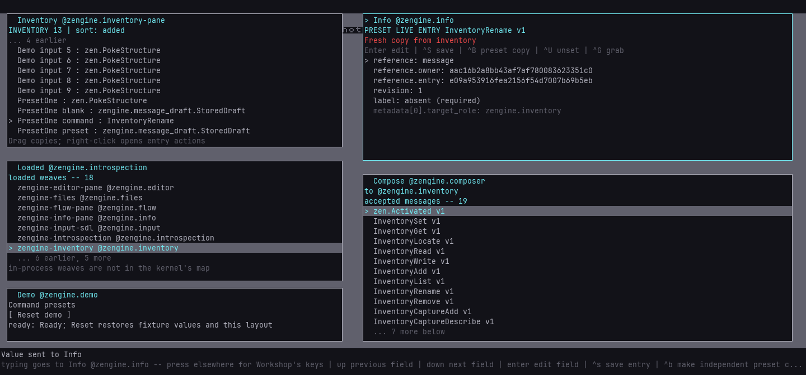
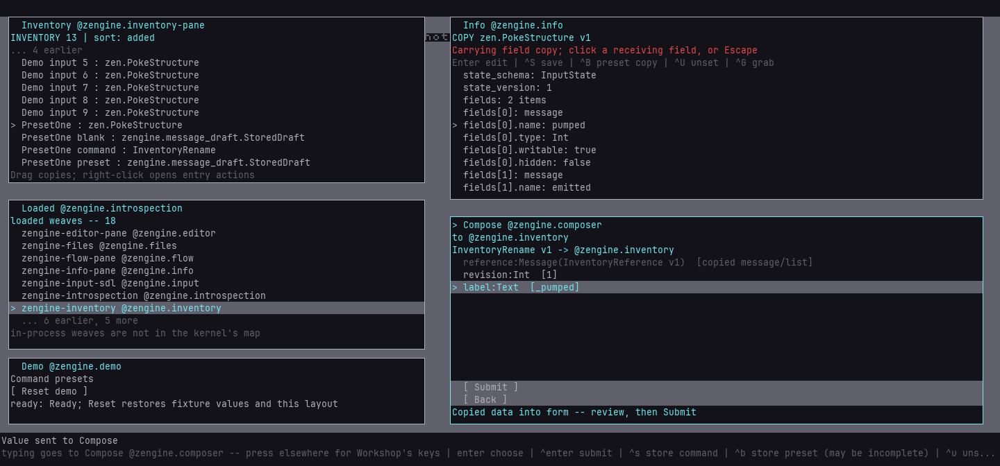

# Reuse a stored command through Compose

Open **Loaded**, **Inventory** and **Compose** in non-overlapping areas of the desk, fully above the bottom status bands. Select
the receiving weave in Loaded; Compose asks that office for its accepted message schemas.

1. Choose a message in Compose. Type scalar fields normally. Drop a compatible stored message
   onto a Message field to copy its data. Tab excludes an existing value before replacement.
2. For an inventory reference argument, use Inventory's secondary **Grab live entry reference**
   action (or Ctrl+Enter), then click the field. Compose stores the reference as data; it does
   not read or modify the referenced object merely because the reference arrived.
3. Complete the form and press **Ctrl+S** to store the complete command as a new inventory entry. Its separate metadata records the
   observed target role; it is neither restored authority nor an automatic destination.
4. Go Back with Escape, then drag the stored command onto Compose's catalog/header. Compose
   validates the whole command against the selected target's current schema snapshot.
5. Review the filled form. Press **Ctrl+Enter** or the Submit row to send it explicitly.

A drop never runs a command. Existing included field values and existing whole drafts are
kept on a conflicting drop. Wrong shapes, stale pictures and failed operations produce a
notice. The current ASCII preview displays unsupported text bytes as '?'; the stored and
submitted value retains those bytes. A missing field remains missing; empty text and false are real values.

Submission checks the current input actor's authority for the exact destination and versioned
shape. Stored data, references and metadata grant no authority. `SUBMITTED` means queued,
not application success. A dispatch refusal or an authenticated `Refused` answer is shown;
other application outcomes remain with their owners. Stored commands retain their original
revision arguments: replay can legitimately be refused after an earlier conditional operation.

## Run the external-host demonstration

Use the [external host setup](external-host.md). The guest needs `input`, `capture`, `inspect`
and `inventory`. Leave Compose with no authored draft and show the three panes above.

```sh
loom-session run <session-dir> workshop/inventory-compose-demo --name compose-demo \
  --input label=Demo --input duration_ms=1500 --input bend=55
```

The tool finds current visible rows, captures an entry, fills a rename command using its live
reference, stores it, drags the command back, and explicitly submits it. It verifies the
intended entry's label and revision and the stored command's unchanged bytes. Screenshots,
`command.bin` and `result.json` remain in the run artifacts. A new run needs a distinct label.

Zengine owns motion and geometry. `bend=0` is linear; nonzero offsets the cubic Bezier control
points in the pointer's coordinate space. The tool sends press, motion request, release; it
does not generate a stream of interpolation points. Physical input may intervene. Failure
does not roll back completed work or retry a command automatically.

Use [toolbox snapshots](toolboxes.md) to keep Inventory data and portable configuration across
restarts, and [Terminal capture](terminal.md#dragging-a-command-or-reply-into-inventory) to acquire messages
from its retained transcript. Bags and undo of external effects remain separate capabilities.

## Make a reusable preset, forward or backward

**Ctrl+B in Compose** stores a preset, including an empty or incomplete form. Ctrl+S retains
its complete-command meaning. Invalid typed text must be corrected before either save.
**Ctrl+U** unsets the selected field and discards its old value; Tab merely excludes/reincludes
local form content. Excluded values do not travel in saved presets.

To work backward, drag a completed command into **Info**, then press **Ctrl+B** to make an
independent preset copy. Select a field and press **Ctrl+U** to remove its value. Required gaps
say `absent (required)`; the schema itself is unchanged. Ctrl+S stores the preset, and Ctrl+R
reads it fresh. Rename its entry in Inventory with Ctrl+N. The label is independent of its stable
entry identity. A primary copy never overwrites the original command; later saves update the
new entry conditionally. A secondary live reference instead opens that exact entry for updates.

Drag the preset onto Compose's empty catalog/header. The selected target must accept its
original schema, including referenced definitions. Retained fields return, missing fields stay
missing, and submission refuses until the original contract is complete.

To fill a gap, drag a saved record into Info, select a present field and press **Ctrl+G**.
Click the compatible missing field in Compose to place the typed copy; Escape cancels pickup.
The same action works for nested fields and read-only capture metadata. It uses structural paths,
not parsing of displayed labels. Existing destination values require explicit unset/exclusion.
The maker or guest needs acquisition permission as well as separate permission to submit.
Loading, editing, saving and filling never execute a command.

The [presets demo setup](demo-setups.md) shows Inventory, Info, Loaded and Compose together:

```sh
loom-session run <session-dir> workshop/inventory-preset-demo --name preset-one --input label=PresetOne
```

It stores a blank template and a completed rename, turns a copy into a partial preset, then
fills its label from a field in a captured Input `PokeStructure` answer. It checks the actual
renamed entry and unchanged stored sources, including refusal of a stale revision replay.
Use Reset demo before repeating with a new label. Saved entries survive Reset, but currently
live only in that Inventory process. Terminal drag-out and multiple Info/Inventory views are
not part of this path.

## Preset demonstration images

A saved preset reopened in Info, with its required label absent and the original command retained.



The typed field copied from the captured record fills Compose. Submission remains a separate act.



## Complete-command demonstration images

A captured drag in progress; Zengine draws the carried-value marker.


The dropped command fills the form without executing it.


After explicit submission, the owner has renamed the source entry.


