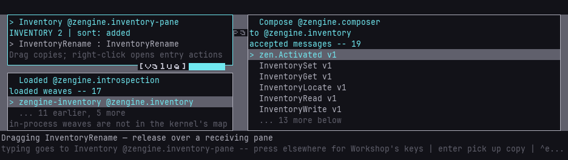
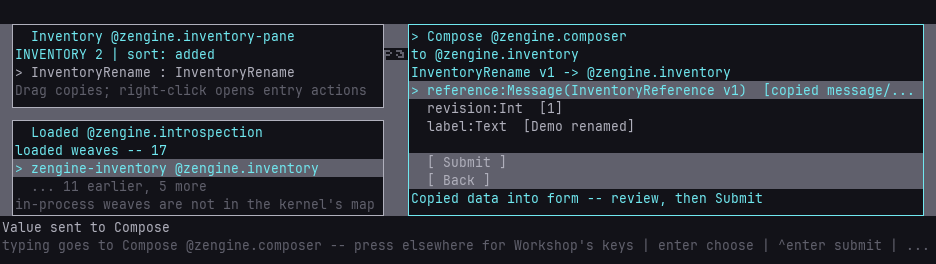
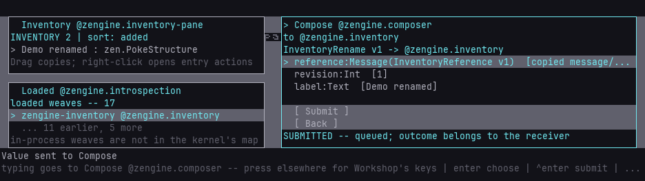

# Reuse a stored command through Compose

Open **Loaded**, **Inventory** and **Compose** in non-overlapping areas of the desk, fully above the bottom status bands. Select
the receiving weave in Loaded; Compose asks that office for its accepted message schemas.

1. Choose a message in Compose. Type scalar fields normally. Drop a compatible stored message
   onto a Message field to copy its data. Tab excludes an existing value before replacement.
2. For an inventory reference argument, use Inventory's secondary **Grab live entry reference**
   action (or Ctrl+Enter), then click the field. Compose stores the reference as data; it does
   not read or modify the referenced object merely because the reference arrived.
3. Complete the form and press **Ctrl+S** to store the complete command as a new inventory entry. Its separate metadata records the
   observed target role; it is neither restored authority nor an automatic destination.
4. Go Back with Escape, then drag the stored command onto Compose's catalog/header. Compose
   validates the whole command against the selected target's current schema snapshot.
5. Review the filled form. Press **Ctrl+Enter** or the Submit row to send it explicitly.

A drop never runs a command. Existing included field values and existing whole drafts are
kept on a conflicting drop. Wrong shapes, stale pictures and failed operations produce a
notice. The current ASCII preview displays unsupported text bytes as '?'; the stored and
submitted value retains those bytes. A missing field remains missing; empty text and false are real values.

Submission checks the current input actor's authority for the exact destination and versioned
shape. Stored data, references and metadata grant no authority. `SUBMITTED` means queued,
not application success. A dispatch refusal or an authenticated `Refused` answer is shown;
other application outcomes remain with their owners. Stored commands retain their original
revision arguments: replay can legitimately be refused after an earlier conditional operation.

## Run the external-host demonstration

Use the [external host setup](external-host.md). The guest needs `input`, `capture`, `inspect`
and `inventory`. Leave Compose with no authored draft and show the three panes above.

```sh
loom-session run <session-dir> workshop/inventory-compose-demo --name compose-demo \
  --input label=Demo --input duration_ms=1500 --input bend=55
```

The tool finds current visible rows, captures an entry, fills a rename command using its live
reference, stores it, drags the command back, and explicitly submits it. It verifies the
intended entry's label and revision and the stored command's unchanged bytes. Screenshots,
`command.bin` and `result.json` remain in the run artifacts. A new run needs a distinct label.

Zengine owns motion and geometry. `bend=0` is linear; nonzero offsets the cubic Bezier control
points in the pointer's coordinate space. The tool sends press, motion request, release; it
does not generate a stream of interpolation points. Physical input may intervene. Failure
does not roll back completed work or retry a command automatically.

Inventory remains process-local. Incomplete presets, command history, scalar field acquisition,
durable bags and undo of external effects are separate capabilities.

## Demonstration images

A captured drag in progress; Zengine draws the carried-value marker.



The dropped command fills the form without executing it.



After explicit submission, the owner has renamed the source entry.


