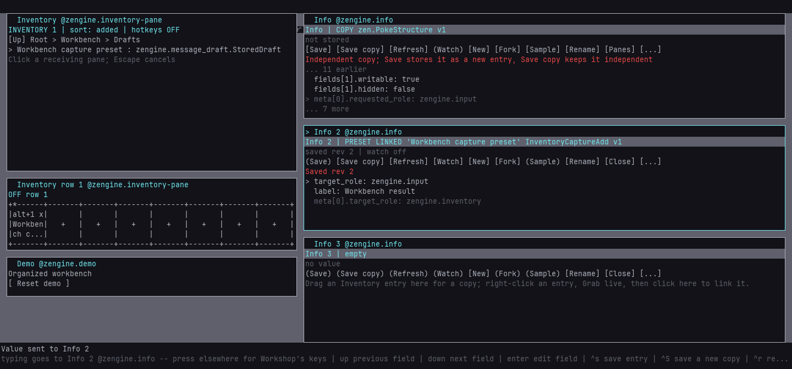
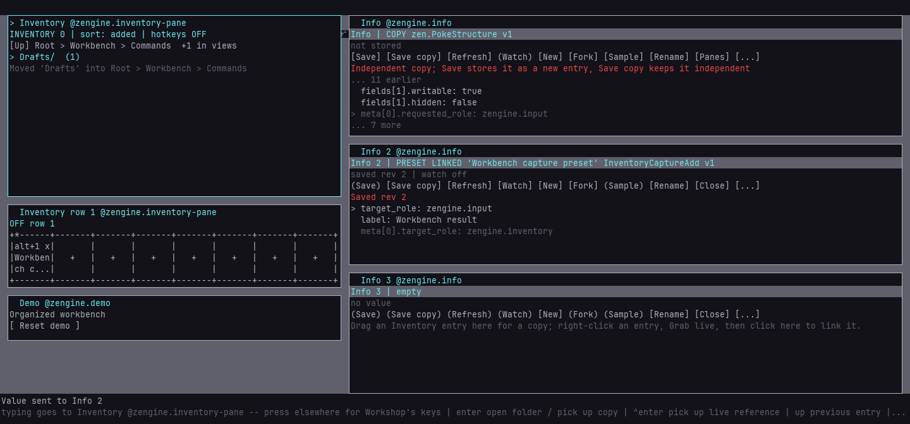

# Organize Inventory in named folders

Group saved samples, commands and presets into named folders, nest them, and open a folder to
see only what it holds. Organization is part of the collection: it survives toolbox save and
restore, and every pane that lists Inventory sees the same folders.



## Make folders and move around

A collection without folders looks as it always did. Right-click Inventory and choose **New
folder here...**, or press **Ctrl+D**; type a name and press Enter. The new folder is created
where you are and selected. As soon as a folder exists, Inventory shows a location row:

```text
[Up] Root > Workbench > Commands  +1 in views
> Drafts/  (2)
  Workbench capture command : InventoryCaptureAdd
```

- **Open** a folder: select it and press **Enter**, or press it once to select it and again to
  open it. Right-click it and choose **Open folder**. A single press never opens a folder, so you
  can point at one to rename or move it.
- **Climb**: **Backspace**, or press **[Up]**. **Alt+Home** goes to Root. Press any crumb in the
  location row to jump to that folder. At Root, Up is shown as `(Up)` and does nothing.
- Folders come first, by name; entries follow in the current sort (Ctrl+S cycles added, name and
  type for entries). Returning to a folder selects the one you came from, and the list scrolls
  to it. A narrow room keeps `[Up]`, Root and the nearest folders, eliding the middle with `...`.
- **Rename** a selected folder with **Ctrl+N** (or **Rename folder...**). While a name line is
  open, Backspace edits the name and never climbs.
- **Remove** an empty folder with **Delete**, twice, or choose **Remove empty folder** and press
  Delete. A folder that still holds anything says what and changes nothing: removing a folder
  never removes entries.
- A menu choice that waits for a key (**Remove empty folder**, **Move to another folder...**, a
  rename) gives the keys to the view you chose it in, wherever you were typing. **Open folder**
  leaves them where they were.

Names are 1 to 64 printable ASCII characters, without `/`, without a leading or trailing space,
and not `.` or `..`. They are kept exactly as typed. Two folders in the same place cannot share a
name ignoring case (`Drafts` and `drafts`); the same name in different folders is fine. Folder
names never conflict with entry names, and entry names keep their own rules. Up to 128 folders
nest at most eight deep.

## File entries and move folders

- **Drag an entry onto a folder row**, a crumb or `[Up]` to file it there. The notice names the
  destination. Dragging onto the list itself does not change its folder.
- **Pick and place**: select an entry or folder and press **Ctrl+X** (or **Move to another
  folder...**). It is marked `[moving]`. Open the destination and press **Ctrl+V** or
  **[Move here]**. Escape cancels. A folder moves with everything inside it and cannot move into
  itself or a folder inside it.
- A copy dropped into Inventory from another pane is stored in the folder you drop it on, or the
  folder you are showing. **Duplicate** keeps the copy beside its source.

Filing never copies or replaces an entry. Its data, capture metadata, name and revision stay as
they were, so an Info view linked to it keeps its unsaved edits and can still save. A drag or a
pick remembers the folder it started from: if something else files the entry elsewhere first,
your drop or Ctrl+V is refused and the entry stays where it now is.

## Folders and portable views

A box, row or column holds entries wherever they are filed. An entry placed in a view is not
listed in Inventory; its folder counts it (`+1 in views`). Dropping a tile on a folder row files
the entry and leaves it in its view. **Return item to main Inventory**, or a displaced single
box, brings it back into its own folder. Hotkeys follow the entry: browsing, filing, renaming
and moving folders never turn a hotkey on, never register one and never run a command.



## Keep the organization

[Save a toolbox](toolboxes.md) as usual. The file keeps folders, their nesting and every entry's
folder beside the portable views and hotkey settings. Restoring it brings the folders back and
starts browsing at Root; hotkeys stay OFF as for any restore. Files saved before folders existed
restore with everything at Root. See the
[Inventory contract](../reference/inventory.md#named-folders) for the messages and limits.

## The organized workbench

The repository keeps an organized copy of the
[inspection workbench](info-views.md#the-inspection-workbench):
`external-host/tools/workshop/toolboxes/inspection-workbench-organized.toolbox`. Its sample and
note are in `Workbench/Samples`, its command in `Workbench/Commands` and in a row with Alt+1 (OFF),
and its incomplete preset in `Workbench/Commands/Drafts`. The `folders` demo setup shows it:

```sh
python external-host/demo.py start --root demo-runs/folders --setup folders --build build --loom-prefix ../Loom/build/_install
loom-session run demo-runs/folders/session workshop/workbench --name restore --input phase=restore --input variant=organized --wait 60
loom-session run demo-runs/folders/session workshop/workbench --name story --input phase=folders --input save=<absolute path>.toolbox --wait 300
python external-host/demo.py stop --root demo-runs/folders
```

The `folders` story reads the stored organization by name every time: it drills down to the
sample and keeps it in Info, climbs by a crumb to the preset and links it in Info 2, fills the
preset from the sample and saves it, then renames the command's folder and moves `Drafts` while
the command stays in its row. With `save=` it writes the result; start another demo, restore that
file with `--input path=<file>` and run the story again. `phase=retrieve` brings the sample into
Info in whichever toolbox is restored, so the same retrieval can be compared flat and organized.
`workbench.json` counts maker gestures, remote asks and picture transfer separately.

Reset the demo's desk with **Reset demo**; restore again to return to the packaged folders. To
change the packaged file, restore the flat workbench in an empty demo and run
`--input phase=organize --input path=<absolute path of the packaged organized file>`, which
organizes it through visible controls and saves it. Never edit its bytes by hand.
