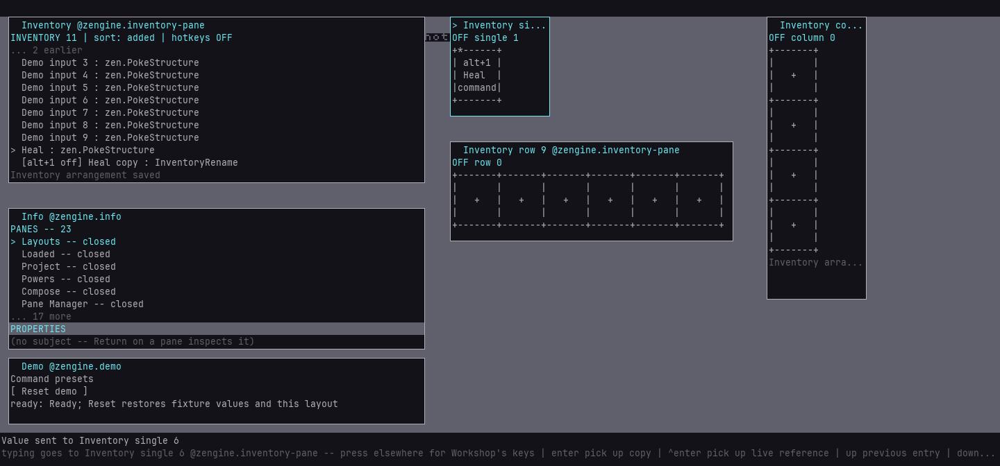
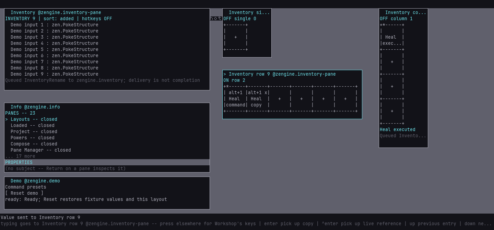

# Portable inventory toolboxes

Right-click a stored entry to pop out a single box, row or column. Drag entries between those
views or back to the main Inventory. A drop before a strip entry reorders it; a filled single box
returns its previous occupant to main Inventory. Other receiving panes still receive copies.

Portable views show compact, roughly square buttons: five text rows high, with nine columns
compensating for the text face's aspect ratio. Rows and columns repeat that footprint with one
shared border. Short names wrap inside each tile; select an entry or open its context menu to
see its full name. Resize a strip to expose more slots, or use arrows/wheel to browse overflow.
The `*` marks selection; `x` after a key means that item's binding is disabled. The view heading
shows whether its context is ON or OFF. Drag from a tile's interior; borders are not entry targets.

A newly copied value dropped into Inventory offers **Name** after it has been stored. Enter
saves the name; Escape keeps the generated name and the stored value. Existing entries can be
changed with right-click **Rename entry...** (or Ctrl+N). Renaming preserves identity, data and
hotkey configuration; moving an existing entry does not prompt for a new name.

Right-click **Duplicate with next number** or **Duplicate and name** for independent data.
The duplicate remembers a configured key and target but starts disabled. To use a command hotkey:

1. **Configure command hotkey**, entering an explicit office and key such as `zengine.inventory alt+1`.
2. **Enable item hotkey** for the item.
3. **Turn this view's hotkeys ON** for its activation context.

The item and context switches are separate. Main Inventory and new contexts start OFF. Moving
an enabled item to an inactive context makes it inactive without erasing its configuration.
Conflicting active keys refuse; existing mappings remain. Closing a window leaves its explicit
activation setting in place. The current actor still needs permission for the actual command.



After moving into an enabled row, the original command can run. Its independent duplicate still
shows its retained key as OFF; the renamed target remains in the column.



## Reusable live demonstration

Start the [presets demo setup](demo-setups.md), then run:

```text
loom-session run <session-dir> workshop/inventory-slots-demo --name slots-one --input label=SlotOne
```

The story saves a complete command through Compose, creates all three views through menus,
configures Alt+1, duplicates its disabled configuration, performs timed drags and single-box
displacement, and verifies one explicit invocation against Inventory's owner revision. It saves
`displaced`, `arranged`, `executed` and `named` pictures plus `result.json` with view state and
request counts. The last step copies a value from a tile and names it on arrival in Inventory,
checking that the source stays unchanged.
The test context is turned OFF on completion/cleanup; entries and view identities remain.

Use Reset before another run and choose a fresh short label. This demo arranges its own panes;
run it in the dedicated demo host. Each run adds three views, within the current twelve-view
bound. Restart the demo host for further independent sessions. Reset preserves stored entries;
it does not undo earlier commands or make view identities reusable by name.

See [Inventory's contract](../reference/inventory.md#portable-boxes-strips-and-command-hotkeys)
for the configuration vocabulary, identity, lifetime and authority boundaries.
