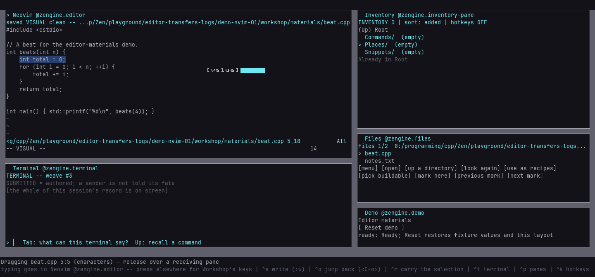
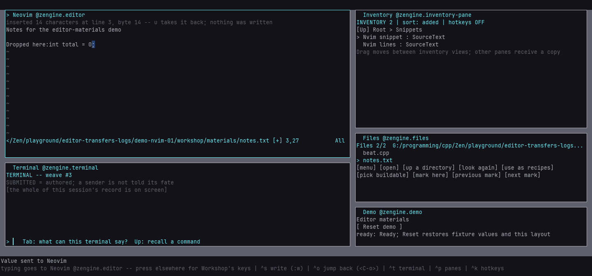

# Neovim in Workshop

**Walkthrough and reference, current state.** Edit in Neovim inside a running Workshop, switch the
Editor between Workshop's standard Editor and Neovim while you work, and take your unsaved edits,
your caret and your selection with you each way. The same Neovim editor also runs from a Loom with
no Workshop at all, with Neovim's own interface in a second terminal. The exact contract is
[editor-switch.md](../reference/editor-switch.md).

## Before you start

- **A Neovim, 0.11 or newer.** Tested on 0.11.6 and 0.12.5. Workshop looks for `nvim` on your
  search path; set `ZENGINE_NEOVIM` to the full path of another one.
- **Your configuration stays yours.** By default Neovim starts **clean**: no `init.lua`, no
  plugins, and its state kept apart from yours under the application name `zengine-neovim-clean`.
  Set `ZENGINE_NEOVIM_PROFILE=user` to start it with your own configuration, or to the path of an
  init file to use that one — see [which configuration is running](#which-configuration-is-running)
  for how to set it, how to check it, and what a mistyped name says.
- **The load plan authors the choice.** Both shipped plans name two editors for the Editor's office,
  `standard` (the one that starts) and `neovim`. A plan of your own names them under `choices`
  ([load plans](load-plans.md#making-your-own); the format is
  [the reference](../reference/load-plan.md#the-file-format)).

## Which configuration is running

Workshop reads two environment variables when it starts a Neovim, and nothing else names either —
no message, no load plan row, no settings file:

| variable | what it names |
|---|---|
| `ZENGINE_NEOVIM` | the program: a full path, or a name found on your search path (default `nvim`) |
| `ZENGINE_NEOVIM_PROFILE` | `clean` (the default), `user` (your own configuration), or the path of an init file |

Set them in the shell you launch Workshop from:

```text
bash/zsh      export ZENGINE_NEOVIM_PROFILE=user
PowerShell    $env:ZENGINE_NEOVIM_PROFILE = "user"
cmd.exe       set ZENGINE_NEOVIM_PROFILE=user
```

A **relative** init path is resolved against the directory you started Workshop in — not against
your project — so `ZENGINE_NEOVIM_PROFILE=./my-init.lua` means the file you can see from the shell
you launched in.

**To see which one is running**, read the Neovim pane's top row: it names the profile in one word
beside Neovim's mode, `saved NORMAL clean -- …`, `UNSAVED INSERT user -- …` or `init file`. The full
words are in the answer to a switch and to a status ask (`clean (no user configuration)`,
`user (the maker's own configuration)`, `init file <path>`). Inside Neovim, `:echo $MYVIMRC` is your
own answer to the same question.

**A name that is neither `clean` nor `user` is treated as an init file**, and if no such file
exists the switch is refused before Neovim starts:

```text
editor switch 2: refused -- ZENGINE_NEOVIM_PROFILE is `User`, which is neither `clean` nor `user`
and names no init file (looked for /home/you/User) -- Neovim was not started
```

That refusal exists because Neovim itself would have started with **no** configuration at all and
an `E282: Cannot read from "User"` message — a third configuration you did not choose.

## Switch while you work

Open the **Terminal** (`Ctrl`+`t`) — your keys land in its line — and type:

```text
ask @zengine.editor-switch EditorSwitchRequested 1 destination=neovim
```

Workshop starts Neovim in the Editor pane's room, hands it the document -- the file, your unsaved
edits, the caret, the selection, the scroll position -- and the Editor pane becomes Neovim, in the
same place on your desk. What came of it is said on Workshop's notice line, in the answer's own
words, followed by what did not cross exactly --
``editor switch 1: switched -- switched zengine.editor from `standard` to `neovim` -- reset: the standard Editor's undo history; ...``
-- and the Terminal's record shows that the answer arrived, with the switch office's weave
number: `v EditorSwitchAnswered v1 from #14  [Loom: answers ask 1]`.

Switch back the same way:

```text
ask @zengine.editor-switch EditorSwitchRequested 1 destination=standard
```

Asking for the editor you already have is harmless: the notice says `already-active` and nothing
is loaded. To see where you are -- which editor holds the office, which are authored, and whether
a switch is under way, said on the notice line:

```text
ask @zengine.editor-switch EditorSwitchStatusRequested 1
```

**Which editor you are in** is also on the pane itself: its title reads `Editor @zengine.editor`
for the standard Editor and `Neovim @zengine.editor` for Neovim, and the top row of Neovim's pane
names Neovim's mode (`saved NORMAL -- ...`) where the standard Editor names a line and column
(`saved L1:C1/4 -- ...`).

### When a switch asks first

A switch away from Neovim can lose something the standard Editor cannot hold -- **another buffer
with unsaved changes**, or a **terminal job** running in Neovim. Then nothing is loaded yet, and
the notice line asks at once: the exact line that confirms, its `op` and its `consent` filled in,
then what the switch would lose --

```text
editor switch 3: needs-confirmation -- confirm: ask @zengine.editor-switch EditorSwitchConfirmed 1 op=3 consent=c4f2a91c7 -- switching to `standard` would lose unsaved changes to ...
```

The Attention pane keeps the same question standing, with the line that cancels it, until you
answer. Type the confirmation into the Terminal:

```text
ask @zengine.editor-switch EditorSwitchConfirmed 1 op=3 consent=c4f2a91c7
```

Use the numbers your notice gave. If what would be lost changes before the switch takes -- you
modify another buffer meanwhile -- you are asked again with a new consent, and nothing crosses on
the old one. To stop instead:

```text
ask @zengine.editor-switch EditorSwitchCancelled 1 op=3
```

Nothing is saved for you, ever: write the other buffer (`:w`) and ask again if you want to keep it.

### When a switch says no

Every refusal says why, in the words of whatever refused, and **nothing moves**: your editor, your
document and your desk are as they were, and the editor you were in tells you on its pane.

| you see | do |
|---|---|
| `Neovim is not available: ...` | install Neovim, or set `ZENGINE_NEOVIM` to it |
| `... older than this Workshop supports` | use Neovim 0.11 or newer |
| `Neovim stopped at a prompt while starting` | your configuration printed an error; fix it, or use the clean profile |
| `ZENGINE_NEOVIM_PROFILE is ... and names no init file` | the profile is misspelled, or the init path is not where you are — see [which configuration is running](#which-configuration-is-running) |
| `Neovim is waiting at a prompt` | answer the prompt in Neovim (usually Enter), then ask again |
| `Neovim's current buffer is not a file` | go to a file's buffer (a help or terminal buffer cannot be carried) |
| `... has no file name` | write it somewhere first (`:w name`) |
| `the standard Editor cannot carry ...` | the document holds bytes the standard Editor does not edit (outside printable ASCII) |
| `switch ... is under way (<stage>)` | a switch is still in progress; wait for its answer, or cancel it |

A pending **count** in Neovim (you typed `3` and stopped) is not a refusal: the switch cancels it
the way Escape would, and says so among the resets. While a switch is under way, the Attention pane
shows it, with the line that cancels it.

## Editing in the Neovim pane

Press into the pane and your keys are Neovim's: modes, motions, `:` commands, search, Visual
selection, undo, macros. The top row is Workshop's -- `saved` or `UNSAVED`, Neovim's mode and the
file -- and it shows a notice when there is one; everything under it is Neovim's own screen.

| key | in the Neovim pane |
|---|---|
| `Ctrl`+`s` | writes the buffer (`:write`), without leaving the mode you are in |
| `Ctrl`+`o` | Neovim's own jump back (and one Normal command from Insert) -- not Workshop's open |
| `Esc` | Neovim's; it never takes you out of the pane |
| `Ctrl`+`r` | in Visual or Select mode, carries a copy of the selection ([below](#carrying-text-commands-and-file-places)); in every other mode Neovim's own (redo, Insert's register) |
| `Ctrl`+`k` | still Workshop's hotkey view |
| a press elsewhere | gives your keys back to Workshop |

A press in Neovim's screen places Neovim's cursor, a drag selects, the wheel scrolls, and a right
press and its release reach Neovim as its own right button — Workshop's menu does not open over
Neovim's screen (its title row still opens it), with two exceptions: a right press **on the Visual
highlight** offers **Extract selection to Inventory** and **Neovim's own menu** (which opens Neovim's
popup exactly as the right press would have), and a right press on the **status row** offers
**Carry this file's location**. A right *drag* does not cross, and a modifier held with a click is
not reported on the window; that is press and release, not Neovim's whole mouse. Resizing the pane
resizes Neovim.

**Opening files reaches Neovim.** The Files pane, the Builder's `e` and **edit code** on a pane all
open into whichever editor holds the office, so while Neovim does, they open in Neovim -- in a new
buffer, beside any unsaved ones.

**Copy and paste cross with everything else.** A yank to `+` or `*` reaches your clipboard, and a
paste from `+` or `*` asks for it -- unless your own configuration chose a clipboard provider, which
is then left alone. **In a terminal** Workshop cannot read your system clipboard, so a paste from
`+` gives the last copy made in Workshop since this Neovim editor started -- a copy made in the
standard Editor before a switch is not one of them. Your terminal's own paste arrives as typing:
paste in Insert mode, because in Normal mode the pasted text runs as Normal-mode commands.

**What the pane cannot show.** Every cell is drawn as one plain character, so box drawing becomes
`-`, `|` and `+` and anything else becomes `?` -- only on screen; the document is untouched. The pane
shows one selection range and no colours: syntax highlighting and search matches are not drawn, and
a blockwise selection shows only its cursor's row.

## Carrying text, commands and file places

The Neovim pane takes part in Workshop's drag and drop exactly as the
[standard Editor](editor.md#carrying-text-commands-and-file-places) does, through Neovim's own
owners: what leaves is what Neovim's own yank would take, and what arrives is inserted by Neovim
as **data, never as keys** — an Escape, a `:qa!` or a carriage return in dropped text stays text.
Nothing dropped is run, sent, written or built. The shapes are in the
[source material reference](../reference/source-transfer.md).

**A selection, out.** Make a Visual (or Select) selection, then drag from inside the highlight to
where it should go, right-click the highlight → **Extract selection to Inventory**, or press
**`Ctrl`+`r`**. A press on the highlight is still Neovim's own click — it ends Visual mode as a
click does — until your hand reaches another cell; then Neovim's selection is put back (`gv`)
and the copy taken at the press leaves. Characterwise, linewise and block selections all travel,
recorded as `characters`, `lines` or `block`: a block's rows are joined by line breaks, with a tab
the block's edge cuts turned into spaces, as Neovim's own yank does. Unsaved changes are included.
A selection holding a NUL byte is refused.



**This file's place, out.** Drag from the **status row**, or right-click it → **Carry this file's
location**. The location action (`neovim.location`) has **no default key**: in Normal mode every
plain `Ctrl` letter already means something to Neovim or to the desktop, so bind it yourself in
your keymap if you want one ([hotkeys](hotkeys.md)).

**Text, in.** Drop text where you want it: it is inserted at that cell, as **one undo step**
(`u` takes the whole drop back), in Normal or Insert mode, and Insert mode stays Insert mode. In
Visual mode a drop **onto the highlight replaces it** (characterwise or linewise); a drop beside
it, onto a block selection, or while Neovim is in any other mode (a `:` command line, an
operator waiting for its motion, a prompt) is refused in Neovim's words and changes nothing. So is
a drop into a read-only or unmodifiable buffer, and a drop aimed at a screen Neovim has since
redrawn: drop it again.



**A command, in.** As in the standard Editor it becomes its Terminal line, never sent. In a buffer
whose `filetype` is `cpp` the drop first asks whether to insert that line or **Generate C++ that
builds it**, which goes in as whole lines above the line you dropped on, in one undo step (from
Normal or Insert mode). Neovim's filetype decides, and only a buffer with none falls back to the
file's extension (a `.h` then gets the choice as "this .h is C++").

**A file place, in.** Dropping a saved location opens its file through the ordinary opening, so
Neovim keeps any modified buffer hidden beside the one it opens — unsaved work is kept, never
reloaded. The cursor moves to the saved line only in that buffer as it was shown, on a line that
still reads as it did; otherwise it is left where it was and the notice says why. A location
whose file is gone is refused before Neovim is asked — Neovim would otherwise start a new, empty
file of that name.

## Ending

- **Hiding or covering the pane** ends nothing; Neovim keeps running.
- **Switching away** ends Neovim once the other editor has the document.
- **`:qa` inside Neovim** ends it; the Editor pane stays, says Neovim exited, and holds no document.
  Opening a file starts a new Neovim.
- **Quitting Workshop** asks Neovim first: it is refused while any buffer has unsaved changes or a
  terminal job is running, naming them.
- **Rebuilding and reloading the Neovim editor itself** is refused while Neovim runs, because a
  reload would end it; quit Neovim or switch editors first.

## From a Loom with no Workshop

The same `zengine-neovim-editor` artifact runs under `loom-host`, installed from a Zengine prefix
(`lib/zengine/`). Neovim runs **headless and listening**, and you attach Neovim's own interface
from a **second terminal**, so `loom-host` keeps its console.

1. Name the Timer and the Neovim editor in your boot file, the Neovim editor in the Editor's office:

   ```json
   {
     "boot": [
       { "name": "zengine-timer", "path": "<prefix>/lib/zengine/zengine-timer.so", "role": "zengine.timer" },
       { "name": "zengine-neovim-editor", "path": "<prefix>/lib/zengine/zengine-neovim-editor.so", "role": "zengine.editor" }
     ]
   }
   ```

   On Windows the files end in `.dll`, and a MinGW build finds its C++ runtime the way a MinGW
   `loom-host.exe` does: with the toolchain's `bin` directory on `PATH`.
2. Start `loom-host` in the directory your files are in. Both are refused until you approve them,
   and the Neovim editor's beat needs the Timer to speak, so decide all of it at once:

   ```text
   loom> authority trust zengine-timer
   loom> authority trust zengine-neovim-editor
   loom> authority allow zengine-neovim-editor EnsureTimer v1 -> role zengine.timer
   loom> authority allow zengine-timer Drive v2 -> role zengine.timer
   loom> authority allow zengine-timer TimerFired v1 -> any target
   loom> authority allow zengine-timer TimerResolution v1 -> any target
   loom> quit
   ```

   Start `loom-host` again: `2 started -- boot COMPLETE`. The Timer settles its own beat when it
   starts, which is why it starts again after the decisions rather than before them. Without the
   beat Neovim still runs, but this host notices Neovim ending only when you next ask.
3. Find the Neovim editor's weave with `weaves` -- the one that accepts `NeovimStartRequested`
   (weave 6 with this boot file) -- and ask it to start Neovim on a file. The console asks for
   every field, so name `listen` too; empty chooses an address for you:

   ```text
   loom> send 6 NeovimStartRequested 1 path="notes.txt" listen=""
     sent.  reply -> m3  Neovim 0.11.6 (clean (no user configuration)) is listening at /tmp/zengine-neovim-4242-1.sock editing /home/you/notes/notes.txt -- attach its interface with: nvim --server /tmp/zengine-neovim-4242-1.sock --remote-ui
   ```

   On Windows the address is a named pipe: `\\.\pipe\zengine-neovim-4242-1`.
4. In a **second terminal**, run the line the answer ends with, and edit: `:w` writes. `:detach`
   in that interface, or closing the second terminal, leaves Neovim running for the next attach
   (Neovim does not support `:detach` on Windows yet; close the terminal there). **`:q` there quits
   Neovim itself**, as it would anywhere: it is Neovim's last window.
5. Back at `loom>`:

   ```text
   loom> send 6 NeovimStatusRequested 1
     sent.  reply -> m4  Neovim 0.11.6 (clean (no user configuration)) (listening at /tmp/zengine-neovim-4242-1.sock for a remote interface) is editing /home/you/notes/notes.txt, saved, in mode n
   loom> send 6 NeovimStopRequested 1 discard=false
     sent.  reply -> m5  Neovim ended (status 0)
   loom> quit
   ```

   The stop is refused while a buffer has unsaved changes -- `refused: Neovim holds unsaved changes
   to ... -- write them first, or stop with discard=true to lose them` -- and `discard=true` ends
   Neovim anyway. After Neovim has ended, from either side, the status says `Neovim is not
   running` and why.
