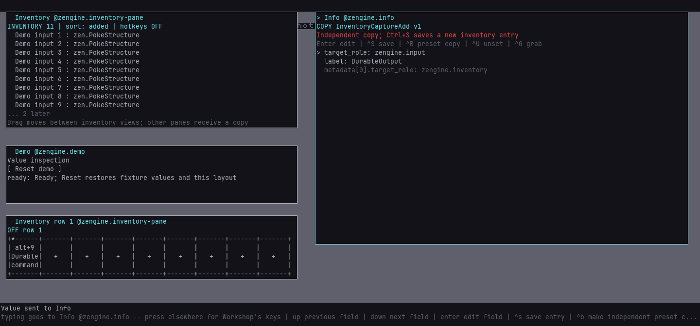

# Save a toolbox for another session

An Inventory toolbox file keeps named entries, their typed capture metadata, portable box/row/
column contents, and configured command targets and keys. Use it to keep useful work or restore
a repeatable starting point for an experiment.

In **Inventory**, right-click and choose **Save toolbox...**, or press **Ctrl+Shift+S**. Enter a
file path and press Enter. This saves a snapshot; later edits are not automatically written.
An existing file at that path is replaced only after the complete candidate is written successfully.

After restarting Workshop, choose **Restore toolbox...** or press **Ctrl+O**. Enter the file path,
press Enter to review replacement, then Enter again to confirm. Escape cancels. Restore replaces
the collection, so save the current toolbox first if you want to keep it. Files are relative to
Workshop's working directory unless you enter an absolute path. Parent directories must exist.

Restored item hotkeys and every activation context start **OFF**. Check each command's target,
enable the item and enable its view when ready. A target is resolved as its current office at
invocation; restoring a file never loads a provider, runs a command or supplies permission.
Commands containing old live references may need fresh fields before they can run.

Toolboxes contain data and slot configuration. Use [setups](setups.md) for screen positions.
Restored portable views are offered in the pane list; open them there or apply a setup that uses
them. Saved view identities are preserved; existing ones are reused. Extra offered views become
empty inactive spares. If the combined identities exceed twelve, restore in a fresh Workshop.
Info/Compose edits remain local; save them to Inventory before saving the toolbox. A live Info
draft from before a restore keeps its text and shows **LINK STALE**; its old reference cannot save
over the new entry, and Save copy stores the text. A restore never turns a watch on.

The repository ships one filled toolbox for trying and testing Info views, with its restore,
story and regeneration recipe: the [inspection workbench](info-views.md#the-inspection-workbench).

## Restore an executor's test fixture

The external host's Workshop guest needs the explicit **`toolbox`** power in its guests file.
This grants toolbox file reads/writes under the Workshop process's filesystem access. It is
separate from `inventory`, `input`, `demo` and command execution. Grant it only to a session
intended to operate those files. Both direct requests and input-driven controls require it.

With a [running ELH session](external-host.md), save once:

```text
loom-session run <session-dir> workshop/toolbox --name save-fixture --input operation=save --input path=fixtures.toolbox
```

On a fresh Workshop, or to reset a running test collection deliberately:

```text
loom-session run <session-dir> workshop/toolbox --name restore-fixture --input path=fixtures.toolbox --input replace=true
```

Each tool run makes **one remote operation request**, without an input session, and retains
`toolbox.json` with the completion, resolved host path, entry count and elapsed milliseconds.
Wait for the run to complete before using the restored data. Query Inventory for current
references; cached references from an earlier restore are invalid. The existing demo setup
service's Reset button still resets its own fixtures; use this restore operation to reset a
saved toolbox instead. Geometry can be restored independently through its setup owner.

## Repeatable restart demonstration

For a repeatable restart proof, use the values [demo setup](demo-setups.md): run
`workshop/toolbox-fixture` with `phase=prepare`, save with `workshop/toolbox`, stop that demo,
start another demo in a fresh root, restore the same absolute toolbox path, then run
`workshop/toolbox-fixture` with `phase=exercise`. It checks that the restored command starts
inactive and explicitly invokes it once under current actor authority. Its `fixture.json`
retains live references, the command's byte hash and request counts for comparison.



After a fresh launch and restore, the saved command can run with current permission and be
dragged into Info. This example turns its hotkey context back OFF after the deliberate invocation.

## Failure and limits

Malformed, oversized or unsupported files refuse before replacing the collection. A writer
that changes Inventory during preparation causes refusal rather than being overwritten.
File errors preserve the previous completed save. A nonempty collection needs `replace=true`
for a direct restore request; the UI's second Enter supplies that intent.

After the collection commit, Desktop clears the old active shortcuts. A failure at this later
step explicitly reports that entries were restored and hotkeys are OFF; it does not claim rollback.
A missing answer can remain pending. Inspect the collection and logs before repeating a replacement.

The file limit is 32 MiB, including at most 8 MiB of encoded pair data, 256 saved entries plus
the compatibility slot, twelve portable views and sixteen bindings. One writer per file path;
this is explicit snapshot persistence, not a synchronized database or power-loss recovery log.
Schema descriptions travel with the values, so an absent source is not required to read them.
Schema migration and automatic command-reference repair are not performed.

See the [Inventory protocol](../reference/inventory.md#durable-toolboxes) for owner boundaries.
