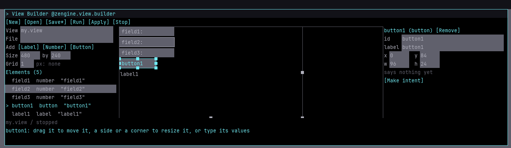
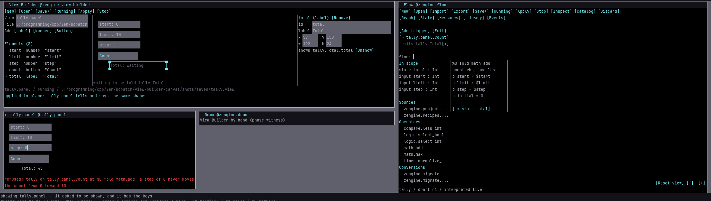
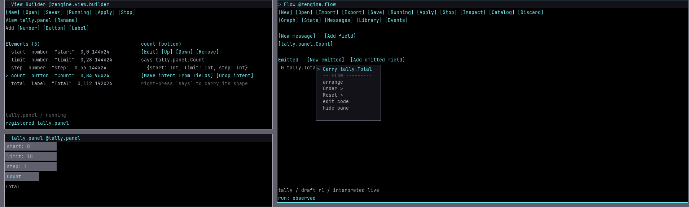
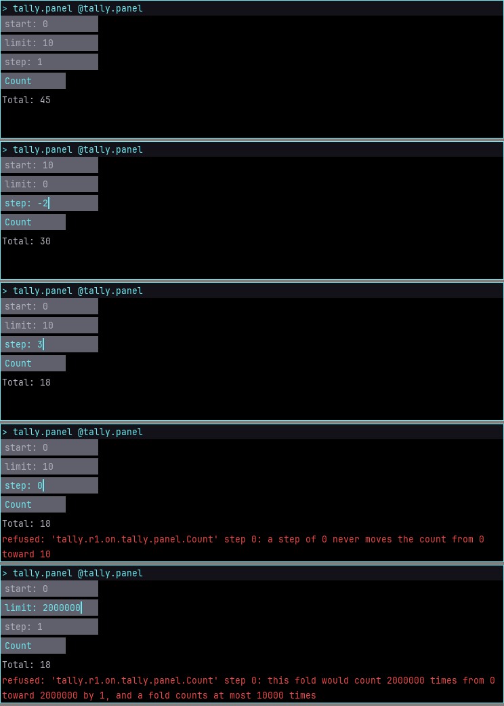

# Make a small panel by hand in the View Builder

The **View Builder** is a pane beside [Flow](flow.md) where you make a small panel, a **view**,
by hand: drag number fields, buttons and labels onto a canvas, move and size them with the
pointer, and type their values where they sit. The canvas is the view's own picture, so what you
see there is what runs. **Run** asks the view host to make the view a participant of its own, and
it opens in a pane of its own. Flow composes what happens when the view speaks; the two meet only
at message shapes, which you drag from one pane to the other. The contract beneath this page is
the [view reference](../reference/view.md).

Open the Pane Manager and choose **View Builder**. The shipped plans include the optional
`zengine-view-builder` artifact in the `zengine.view.builder` office.

## The builder

On the left are the view's name and file in boxes, **Add** with the three kinds of element, and
the list of the view's elements. In the middle is the design canvas: the view drawn by its own
picture code at its own pixels, 12 to a cell, the same picture it shows when it runs. In a wide
pane the selected element's values sit in boxes on the right; in a narrow one, below the list.

- **Make** an element by dragging **Label**, **Number** or **Button** from **Add** onto the
  canvas: it is made where you let go. A click on a kind makes one below the last.
- **Select** one by clicking it on the canvas or in the list. It is outlined, with a handle at
  each corner.
- **Move** it by dragging it, and **size** it by dragging a corner handle, in whole pixels; it
  never goes past the canvas's top or left. The arrow keys move the selected element a pixel,
  and with `Shift` a cell. A drag cut short -- a menu opening, the pane resized -- puts the
  element back where it was.
- **Type its values**: click a box -- `id`, `label`, a number field's starting `text`, `x`, `y`,
  `w`, `h` -- type, and press `Return`. `Tab` keeps the value and selects the next box's whole,
  so typing replaces it; `Escape` puts the value back. A value the view's rules refuse stays in
  its box with the reason on the last row. A drag and a typed value change the same element.
- **Rest** the pointer on an element and it is marked, and its row with it.
- `Delete` or **Remove** removes the selected element. **New** or **Open** over an unsaved view
  asks for a second press before it discards it.



## Make the tally panel

The panel counts from a start toward a limit by a step, and shows the total a Flow definition
named `tally` works out.

1. Click **View**, type `tally.panel` and press `Return`. The name is the view's office, the name
   its pane is listed under, and the namespace of what it says.
2. Drag **Number** onto the canvas three times, then a **Button** and a **Label** beneath them.
3. Select each and type its values: number fields `start`, `limit` and `step` (give `step` the
   starting text `1`), a button `count` labelled `Count`, and a label `total` labelled `Total`.
   An id names a field an intent will carry, so it is letters, digits and `_`. Drag and resize
   them until the panel looks right.
4. Select `count` and press **Make intent**: the builder makes `tally.panel.Count {start: Int,
   limit: Int, step: Int}`, one required `Int` for each number field, named after the button's
   label, through the same shape rules Flow declares messages with, and `count` says it. Its
   name after `says tally.panel.` is a box, if you want another.
5. Press **Run**. The panel opens in its own pane; `Total` says `waiting`, and so does its last
   row, until something tells it `tally.Total`.



## Drag shapes between the builder and Flow

Shapes cross both ways by dragging them, or by a menu: right-press the line, choose **Carry**,
then click where it goes.

- **The intent into Flow.** In the builder, select `count` and drag its `says tally.panel.` words
  onto Flow. Flow offers **Declare tally.panel.Count v1 as an accepted message**. Make the
  `tally` definition there with a fold of `math.add` ([finding the fold](flow.md#find-what-to-compose))
  and an emitted `tally.Total {total}` ([emits](flow.md#say-what-changed-emits)).
- **What Flow says, onto a label.** In Flow's **Messages**, drag `tally.Total` from under
  **Emitted** onto the `Total` label on the canvas, or onto its row in the list. While you hold it
  over a label, the label is marked where it would land. A shape with one field a label can show
  is bound at once (`shows tally.Total.total`); with several, the builder asks which, with a
  button for each, wrapped to the values' width; when they are more than the pane's rows hold,
  **More** shows the next of them. A value from Inventory binds by its shape, and a field
  carried from Info binds that field.



Binding `Total` changes what the view is told, so **Apply** registers the view afresh and says
so; its field text starts again from the description. A later change to a label, a place or a
size keeps the same shapes, and **Apply** takes it in place: what you typed stays. If the new
view cannot register -- an intent whose fields changed while something still listens for the
old ones under the same name and version, say -- **Apply** says why, and the running panel goes
on as it was.

## Use it

With `tally` running in Flow, type into the panel's fields (press a field, then type; `Tab`
moves between fields) and press **Count**, or `Return` in a field:

| start, limit, step | the panel shows |
|---|---|
| `0, 10, 1` | `Total: 45` |
| `10, 0, -2` | `Total: 30` |
| `0, 10, 3` | `Total: 18` |
| `0, 10, 0` | `refused: tally on tally.panel.Count at %0 fold math.add: a step of 0 never moves the count from 0 toward 10`, and `Total` stays |
| `0, 2000000, 1` | refused by the fold's count bound, and `Total` stays |



The panel publishes `tally.panel.Count` as its own participant; whoever accepts that shape hears
it. It does not know `tally`, and `tally` does not know the panel: the panel is told
`tally.Total` because it accepts that shape. A refusal answered to the panel is shown on its last
rows, in its owner's words: which definition refused, on which message, and at which node of its
graph, numbered and titled as Flow shows it. A field that holds no whole number is said there,
and nothing is published.

Type a `.view` file into **File** and press **Save** (`Ctrl`+`s`), and save the Flow workspace
beside it. Quit, start
Workshop again, type the file into **File** and press **Open**, open the workspace in Flow, and
**Run** both: the panel works as before and waits until told.
Nothing that was running is in either file. **Stop** ends the panel: its pane first says it
stopped, and once Workshop sees its participant gone it says it is waiting for the provider. No
field or button is left that looks live.

In a terminal Workshop the builder works as it does in a window, its picture floored to cells: a
drag moves an element by whole cells, 12 pixels each, and a value typed into its box is still a
pixel. The same panel works too, its picture the window's floored to cells and each line fitted
to the cell. Here a step of 0 was refused, and the total stayed:

```text
> tally.panel @tally.panel

 ............
 .start: 0...

 ............
 .limit: 10..

 ............
 .step: 0_...

 ...........
 .Count.....

     Total: 45


refused: tally on tally.panel.Count at %0 fold
math.add: a step of 0 never moves the count from 0
toward 10
```

## Views here, in Info and in Inventory

Three panes show something called a view, and they are different things:

- **A described view** is a participant of its own, made from a description: it is told values by
  their shape and says intents by publication. You build it here and it runs in its own pane.
- **An [Info view](info-views.md)** is one of Info's own windows onto a typed value you are
  inspecting or editing; it belongs to Info and speaks for nothing.
- **A [portable Inventory view](inventory-slots.md)** is a box, row or column of stored entries;
  it belongs to Inventory and holds entries, not a panel.

## The View Builder or the Pane Creator

Reach for the [Pane Creator](panes.md#the-pane-creator--a-pane-made-of-data) for a pane of static
text that Workshop paints and you place in Info. Reach for the View Builder when the pane must be
told values, take typing, or say something when a control is used. The two stay side by side.

## Limits

Three element kinds: a label, a number field that holds a whole number, and a button, placed
side by side, never inside one another. A button says at most one intent, made from all the
view's number fields. A label shows one top-level field. The canvas shows the view from its top
left corner and does not scroll or zoom. A window does not say when the pointer leaves it, so a
mark made under the pointer stays until the pointer moves inside the window again; a terminal
reports no resting pointer at all, so there only a carried value is marked.
