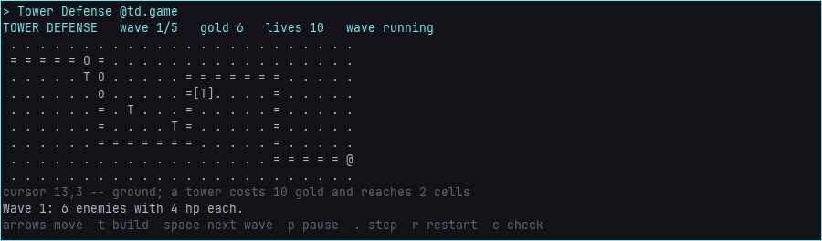
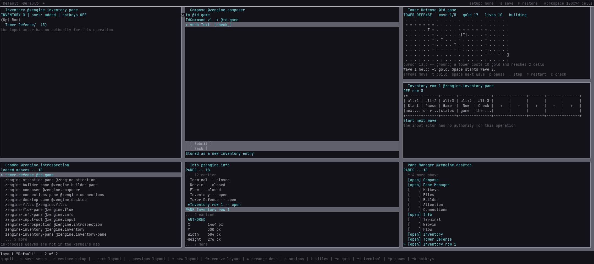

# Tower Defense, made from inside Workshop

A small tower defense game that runs in a Workshop pane, and a replayable account of how it was
made. An external Loom host (ELH) drove a running Workshop the way a maker would: Neovim typed the
game in four milestones, Files authored its recipe, the Builder built it and reloaded it in place
after every milestone, Info arranged the desk and Inventory kept the game's commands. `story.py`
does all of that again, from an empty game directory, at the speed you choose.



## Play it

One map, one road from the left edge to the base (`@`), five waves.

| you see | it is |
|---|---|
| `.` | ground: a tower can go here |
| `=` | the road the enemies walk |
| `T` | a tower: 10 gold, shoots once every three ticks at the enemy in reach (two cells, any direction) that is nearest the base |
| `o` `O` | an enemy with 3 hp or fewer, or more |
| `[.]` | the cursor |

You start with 40 gold and 10 lives. A stopped enemy pays 2 gold and a held wave 5 more; an enemy
that reaches the base costs a life. Hold all five waves to win; lose the last life and the game is
over. Waves grow: wave *n* sends 4+2*n* enemies with 2+2*n* hp, faster from wave 3.

| key | does |
|---|---|
| arrows | move the cursor |
| `t` | build a tower on the cursor's cell |
| `Space` | start the next wave |
| `p` / `.` | pause and resume a wave / one step while paused |
| `r` | a new game |
| `c` | check the rules: twelve checks on scratch games, `rules check: 12/12 passed` |

Press a cell to choose it and press it again to build there. The keys are the pane's declared
actions, so the Hotkeys pane lists them and your keymap can move them.

Other participants can drive it with a `TdCommand` whose `verb` is `wave`, `pause`, `step`,
`restart`, `check` or `status`; it answers with a `zen.Result` naming the numbers the rules
change. Compose composes one from the game's accepted shapes (Loaded, then `tower-defense`).

## Build it into your own project

`td.cpp` is one source file that uses only headers the installed Zengine and Loom packages publish.
In a project directory holding a copy of it, [author its recipe in Files](../../docs/workshop/builder.md#authoring-a-recipe-from-files)
(`a`) with the links `zengine::pane,zengine::activation,zengine::input,zengine::timer,loom::switchboard`,
add it to the load plan in the Builder (`o`) with the role `td.game`, and build what the project
waits on (`f`). [Edit a running pane](../../docs/workshop/edit-a-running-pane.md) is the same loop
for a smaller pane.

A recipe written from Files borrows no toolchain: CMake chooses this machine's default. Where that
default is not the compiler Workshop was built with -- on Windows with several compilers
installed, say -- the first build fails with CMake's own words (`CMAKE_CXX_COMPILER not set`).
Name the configured build tree Workshop came from in the recipe's `toolchain_from`, and a fresh
directory in its `workspace`, in a text editor ([the recipe format](../../docs/workshop/builder.md#one-source-file)),
then press `u` on the catalog in Files and build again. The story does exactly that when it has to.

The game's state is its save format across a reload: every field the finished game needs was
declared in the first milestone, because a rebuilt pane whose state or messages changed is refused
rather than migrated. Rules and pictures can change freely; the structs cannot.

## Make it again

Prerequisites: a [built Zengine](../../docs/contributing/build-and-test.md) with the SDL skin, its
installed prefix and an installed Loom (with `loom-host`, `loom-runs` and the Python session
runtime), Neovim 0.11 or newer on `PATH`, and Python 3.8 or later.

```sh
python examples/tower-defense/story.py start --root demo-runs/td --build build \
       --loom-prefix <installed Loom> --zengine-prefix <installed Zengine> [--toolchain-bin <dir>]
python examples/tower-defense/story.py replay --root demo-runs/td --speed watch
```

`start` makes a new root and refuses one that exists: a development runtime copied from your build
tree, an empty `game/` directory, Workshop launched from the runtime with that directory as its
project (its window sized by `--viewport`, 180x80 cells unless you say otherwise: the story places
panes for that room), and a Loom session linked to it as a guest with `input`, `capture`,
`inspect`, `inventory` and `toolbox` powers. `--toolchain-bin` puts a directory first on `PATH`
for both processes, such as a MinGW `bin` the built programs need.

`replay` then tells the story step by step (`story.py steps` lists them). Each step is one or
more runs of a maintained tool in the [`workshop` package](../../docs/workshop/external-host.md#3-from-a-loom-session-journeys-as-python-tools),
and the script itself never reads or writes the game project:

| steps | what happens | tools |
|---|---|---|
| connect, editor | the link is checked; the Editor switches to Neovim from the Terminal | `connections`, `act` |
| desk | panes are opened and placed | `act`, `place` |
| m1 | `td.cpp` is created in the empty directory by Neovim | `nvim-edit` |
| recipe, load, first-build | the recipe is authored in Files, loaded with its role and built; a failure for want of a toolchain is read and repaired in the recipe | `act`, `verify-recipe`, `builder`, `source`, `nvim-edit` |
| game-pane, save-desk, arm | the game's pane is placed, the desk saved (`workshop-setup.json`), load-after-build turned on | `act`, `place`, `builder` |
| m2, m3, m4 | each milestone's edits typed, built and reloaded in place, then tried | `nvim-edit`, `builder`, `act` |
| toolbox | a second layout; five commands stored through Compose, named and filed in a folder, bound to Alt+1..Alt+5 in a portable row; the guest's own attempt to run one is refused; the toolbox saved | `act`, `place`, `inventory-organize`, `inventory-controls`, `toolbox` |
| back, play | the build desk restored from its setup file; a session played from a new game to a win | `act` |
| keep, same | the final image promoted; the typed `td.cpp` compared with this directory's | `builder`, `source` |

The milestones are [`story/`](story/): each folder's `edits.json` names the edits
`workshop/nvim-edit` makes, and its text files hold what is typed. Applied in order to an empty file
they give this directory's `td.cpp` byte for byte, and the last step checks it.

**Pace.** `--speed watch` types in small chunks with pauses, slows each gesture and waits between
steps; `--speed fast` does none of that; a number is a factor of the watch pace, so `0.5` is
between the two and `3` is slower than `watch`. Builds, reloads and every check wait on the real
operation at any speed. `--paused` starts the replay paused before its first step. While a replay
runs, from another shell:

| command | does |
|---|---|
| `story.py pause --root DIR` | stop before the next step; the step running now finishes |
| `story.py step --root DIR` | let exactly one more step run, then stay paused |
| `story.py resume --root DIR` | carry on |
| `story.py speed --root DIR fast` | change the pace from the next step |
| `story.py cancel --root DIR` | ask the run manager to cancel the run in progress, then follow it until the manager says how it ended (`cancelled`, and its cleanup giving Workshop's input back); the replay stops |
| `story.py status --root DIR` | the step, the current run as its manager tells it now, the pace, the link, and whether the root's Workshop and Loom host still run |

A paused replay says which step it waits before. A cancelled or failed replay does not resume: its
root keeps everything it did, and the next attempt starts from a new root.

**A wait that runs out is not an ending.** Each run is waited for; if the story's wait runs out
first -- or the Loom session stops answering -- the replay stops UNRESOLVED and the run's handle
(its name and session lifetime) stays in `story-status.json`. It is still the run manager's:
`status` reads it again and writes down a result that arrives late, and `cancel` asks for its
cancellation and reports the ending it then sees. Until the run is seen to settle, nothing new
starts on that root, and a session that does not answer is never taken for a run that stopped.

**Stop and reset.** A root keeps, for the Workshop and the Loom host it starts, their process id
and the start time the operating system gave each, so a later command can tell the same process
from a new one that reused the id. `story.py stop` asks Workshop to quit the way a maker does (a
pane put down, then `q`) and believes it gone only when its process is seen to end; only then
does it end the Loom session, and it waits to see that host end too. A Workshop that refuses to
quit is left running, with its session, and said. Workshop refuses while Neovim holds unsaved
work, which a replay cancelled in the middle of an edit leaves behind: `--discard-unsaved` first
abandons all of it in Neovim (`Escape`, `:qa!`, which ends Neovim), as Workshop's notice allows.
`--force` ends a Workshop or host that will not stop -- only once its start time confirms it is
the one this root started, and it says so only when the ending is seen. `story.py reset` (which
takes the same flags) stops the story, then renames its root to `<root>.retired-<time>` so the
same path can start again; it renames nothing while either process is not seen ended, whatever
the Loom session answered. Nothing is deleted, and nothing outside the root is touched.

**Launch it again.** After `stop`, `story.py again --root DIR` launches a new Workshop and a new
Loom session on the kept game. In the window, Workshop starts in the game directory with no plan
named, so the project's own plan loads the promoted image. With `--tui` it is the terminal
medium instead: a load plan names its skin, so the runtime's terminal plan runs in a project of
its own (`DIR/again-N/project`) with the story's recipes, and the Builder's `o` loads the game.
Either way the game's pane is opened, its rules check must pass and a wave runs under its keys;
then this directory's `tower-defense.toolbox` is restored beside it and Inventory must show its
folder with the hotkeys OFF. That Workshop is then stopped as `stop` stops one -- ended, once its
identity is confirmed, only if it will not quit -- and `again.json` says which it was. Its
record, runs and picture stay in `DIR/again-N/`.

**What a replay leaves.** `story-status.json` in the root names every run, its verdict, its seconds
and how many asks it made -- and, while one is unresolved, its handle; each run's own record,
inputs and outputs (pictures included) stay in `elh/runs/`. A Builder run's `builder.json` keeps
the build's outcome and the realization's outcome as two entries, each with its operation number. The game directory ends with `td.cpp`, `build-recipes.json`, `workshop-plan.json`,
`workshop-setup.json` and `tower-defense.toolbox`.

## Keep the toolbox for everyday use



`tower-defense.toolbox` here was saved by Inventory itself at the end of a replay. Restore it into a
Workshop that has the game loaded with `workshop/toolbox` (`--input path=<this file> --input
replace=true`) or Inventory's **Restore toolbox...**. Hotkeys come back OFF: enable the items and
the row's context to use Alt+1..Alt+5. A stored command runs with the pressing actor's own
authority -- a maker's hand, or a guest only where its grant allows `TdCommand` to `td.game`
(the story's guest is refused, and says so).

To run one by your own hand, after a replay and `stop`:

1. `python examples/tower-defense/story.py again --root DIR --hold` -- the kept game loads, its
   checks pass, the toolbox is restored, and that Workshop stays up.
2. In its window: Ctrl+P, choose **Inventory row 1**, Enter -- the five commands in a row.
3. Right-click **Start next wave**, choose **Enable item hotkey**; right-click the row, choose
   **Turn this view's hotkeys ON**.
4. Press Alt+1: the game's pane says `Wave 1:` and enemies walk the road.
5. Press Return in the shell (or create `DIR/again-N/release`); that Workshop is stopped.

## What this does not show

- The story replays the finished route; it is not a recording of the session that first made the
  game, and a change that session made to Workshop itself (the Builder's `realize` row naming its
  operation) is in Workshop's own history, not in a replay.
- A stored command run by a maker's own hand; the guest demonstrates only the refusal.
- Anything Workshop cannot do yet: a changed state shape is not reloaded, and Workshop's Terminal
  speaks only the vocabulary its host gave it, so `TdCommand` is sent from Compose instead.
