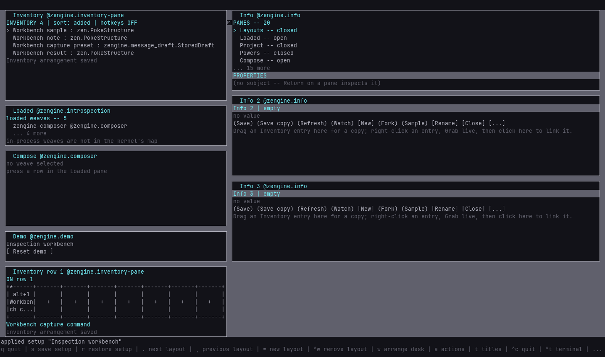

# Inspection workbench setup

A ready desk for inspecting typed values: Inventory, Loaded, Compose and three independent Info
views, filled with the workbench toolbox, and a hotkey row whose **Alt+1** captures Input's state
into a new Inventory entry. Choose it to inspect values side by side, or when a test or story needs
a known inspection fixture.

```sh
python external-host/demo.py describe workbench
python external-host/demo.py start --setup workbench --root demo-runs/workbench --build <build> --loom-prefix <installed Loom>
```

`start` returns once the desk, the four entries, the row and its key are usable, and prints this
guide's path. Start it again with the same root to return to it: your work stays as it is.

## First task

1. Press **Alt+1** with the Workshop window focused. Inventory gains `Workbench result`, a fresh
   capture of Input's state shape, one per press. The key works from any pane.
2. Drag the new `Workbench result` into the first Info view: it shows the captured fields as an
   independent copy. The stored `Workbench sample` is unchanged.

Useful next steps, all on the same desk:

- Link `Workbench capture preset` into the second view (select it, `Ctrl`+`Enter`, click the
  view) and drag the sample's `requested_role` field onto its `target_role`.
- Watch `Workbench note` in the third view while the second view saves it.
- Run the whole maker story: `loom-session run <session> workshop/workbench --input phase=story`
  ([the inspection workbench](../../../../../docs/workshop/info-views.md#the-inspection-workbench)).

## The hotkey

| chord | runs | on | context |
|---|---|---|---|
| Alt+1 | `Workbench capture command` (`InventoryCaptureAdd`, label `Workbench result`) | `zengine.inventory` | the row at the bottom left, `ON row 1` |

Preparation turns the item's binding and the row's context ON, through Inventory's own
configuration door; a toolbox restore alone leaves both OFF. The command runs with the pressing
actor's permission: yours, or the setup guest's, which may capture into Inventory. To disable it,
right-click the tile and choose **Disable item hotkey**, or turn the row's hotkeys OFF. To change
the chord, right-click **Configure command hotkey** (`zengine.inventory alt+2`, say); Reset puts
the declared chord back. A chord another active view already uses is refused by Inventory, and
preparation reports that refusal instead of ready.

## Reset and recovery



Press **Reset demo**, or run `python external-host/demo.py reset --root <root>`. Reset restores
the layout, the four workbench entries' values, labels and folders, the row's binding and its ON
switches, Inventory's selection and the Info and Compose drafts. It keeps every entry you created,
including `Workbench result` captures and saved copies. Save a draft to Inventory before Reset if
you want to keep it. A pane with an operation in flight refuses Reset and the refusal names it;
steps completed before it stay applied.

`python external-host/demo.py status --root <root>` reports the state; `stop` ends Workshop and the
Loom session. A root is reused only while its recorded Loom session is the one answering.

## Limits

- The Info views and Compose are disposable drafts here.
- The row is seated by preparation; moving the command out of it makes Reset put it back.
- Regenerating the packaged toolbox is `workshop/workbench` phase=prepare, in a Workshop without
  workbench entries.
