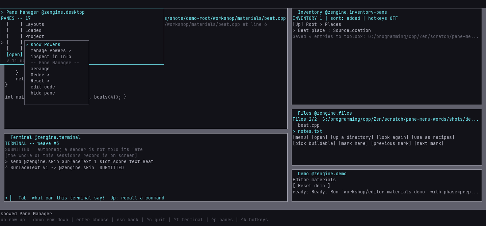
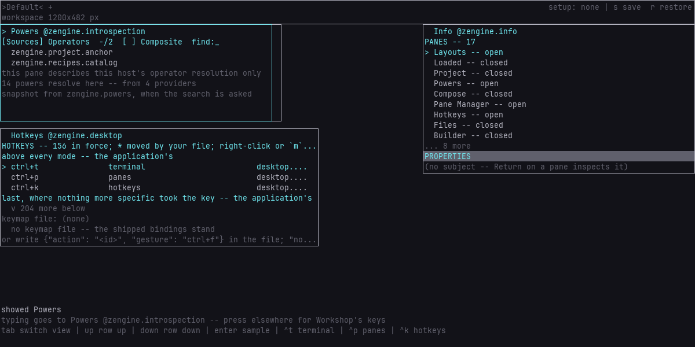
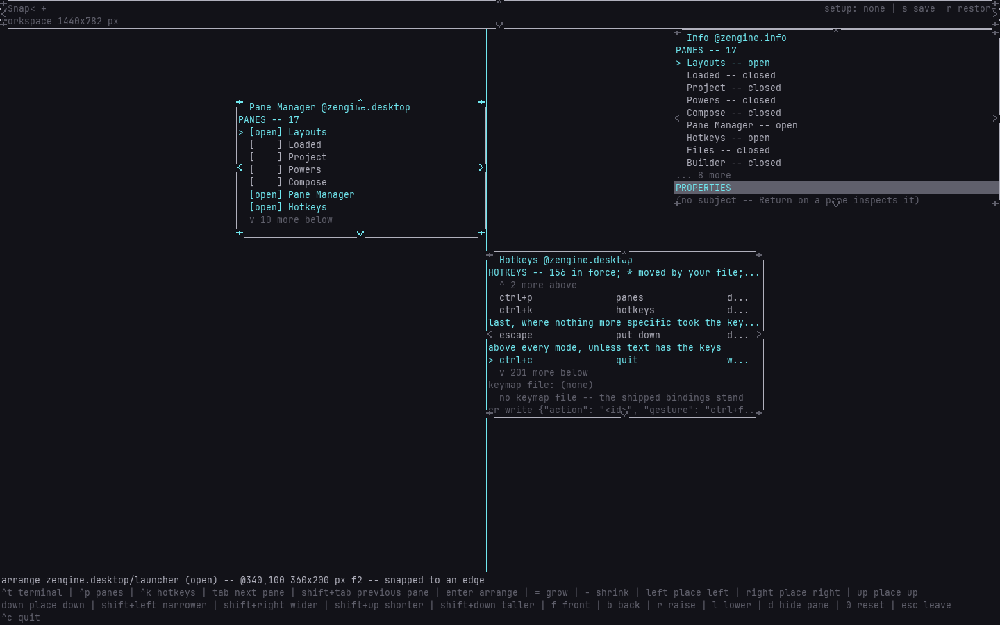
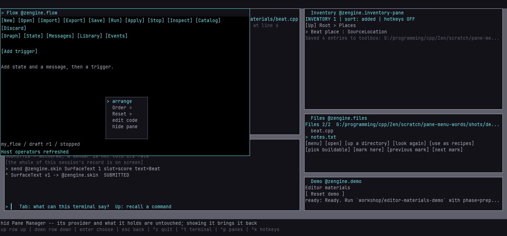
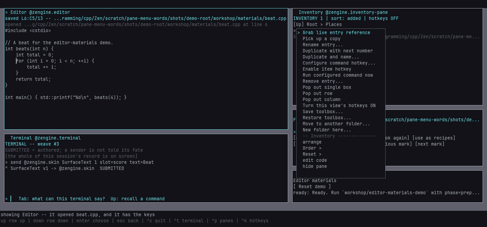
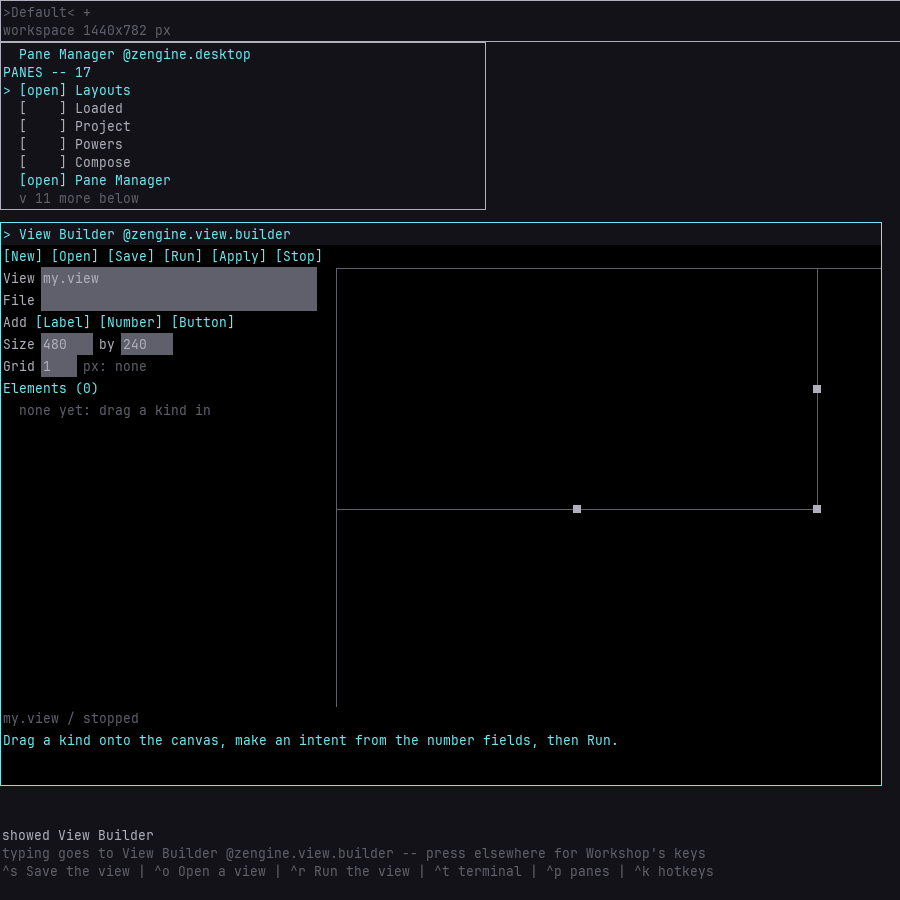

# Panes

New panes request space suited to their work. Workshop converts those body text rows and columns
using the current display's text metrics, reserves title/border space and fits the available room.
Saved sizes and your resizing win. Lists request room for at least three items as well as headings,
footers and earlier/later markers; a smaller window or your own smaller size can show less.
Older providers keep the existing fallback. Refreshing an offer does not resize the pane.


**How-to.** Opening, closing, moving, resizing and ordering Workshop's panes, and the honest
answer to "how do I get a bigger one".

A **pane** is one region of Workshop's screen. Two kinds exist and a weaver does not need to
tell them apart to use them:

- **the one built-in** — `Layouts`, the
  [layout selector](setups.md#several-layouts-in-one-workshop) at the top of the screen, which
  is a pane like the rest of them: move it, cover it, hide it.
- **panes a loaded weave offers** — through a bounded protocol. The **desktop** offers two:
  the **Pane Manager** ([below](#showing-going-to-and-hiding--the-pane-manager)), where every
  pane is shown, hidden and made, and **Hotkeys**. `Info`, `Builder`, `Attention`, `Files`,
  `Editor`, `Terminal`, `Loaded`, `Project`, `Powers` and `Compose` arrive the same way. `Info`
  is the one your desk names for you, so it is on screen on a first run.
- **a pane you made** — a view: a panel of number fields, buttons and labels made by hand in
  the [View Builder](../../view/docs/view-builder.md) (`n` in the Pane Manager shows it) and run as a
  participant of its own, in its own pane — [a pane of your own](#a-pane-of-your-own--a-view).

## Showing, going to and hiding — the Pane Manager

Press **`Ctrl`+`p`**, from anywhere — it works while your hands are inside another pane — and
the **Pane Manager** shows with the keys; press it again and the Pane Manager hides. It is a
strict show/hide toggle, judged by Workshop against your layout as it is when the key arrives, so
a queued second press never quietly means the same thing twice. It lists every pane there is:
the union of what this Workshop can present and what your layout names.

```
PANES -- 8
  [open] Layouts
> [    ] Builder          a hidden tool: Enter shows it and puts you in it
  [open] Terminal         already here: Enter takes you to it, and hides nothing
  [gone] Info             nothing is offering this pane in this Workshop
  [load] Attention        this run has not finished loading its tool yet
```

| key | does |
|---|---|
| `↑` `↓` | choose a row |
| `Enter` | show it and put you in it — or, if it is shown, just go to it |
| `x` | hide it: take it off the layout |
| `m` | the row's menu: show / focus / hide, `manage <pane> >`, `inspect in Info` |
| `n` | make a pane of your own — shows the [View Builder](#a-pane-of-your-own--a-view) |

**By mouse.** Click the mark — `[    ]` or `[open]` — and the pane is shown or hidden; click the
name and the marker moves there, opening nothing; click the marked name **again**, with the keys
already in the Pane Manager, and that is `Enter`: the pane opens, or comes to the front with the
keys if it was open and covered. The wheel walks the marker a row per notch. Right-click a row
(or press `m` on the marked one) for its menu beside the pointer: `show Beta`, or `focus Beta`
and `hide Beta` for a pane on the layout; **`manage Beta >`**, which opens Workshop's own pane
menu for *that* pane — arrange, order, reset, edit code, hide pane — whether it is covered,
hidden, or a pane that keeps every right-click for itself; and **`inspect in Info`**, which
makes it Info's subject through Info's own door. Beneath those rows, under a rule that names
the Pane Manager, are Workshop's own rows for the Pane Manager itself, as in every pane's menu.
A right-click on the heading or a `more` marker opens Workshop's menu for the Pane Manager
itself. A click that arrives after the list moved under it — a pane arrived, a scroll
was queued ahead of it — is refused with `the list moved -- press again` rather than acting on
whatever slid into that row; a repaint that moved no row does not refuse.



**A pane you show lands in sight.** A pane with no place of its own stands in the column
down the room's left, under the panes already there; when the column has no room left for it, the
column begins again at its top, so the pane lands there, in front of whatever it covers. Nothing
is refused for want of room, from the Pane Manager, a launch key or `n` alike; move it where you
want it by [arranging](#moving-resizing-and-ordering--arrange). A pane keeps a place you gave it:
if that place is off this screen, showing it says so on the band, with the two ways back --
`Reset >` `place` in its menu, which the Pane Manager's `manage <pane> >` reaches, or hiding it
and showing it again.



**Showing never toggles.** `Enter` on a shown pane — or `Ctrl`+`t` while the Terminal is up —
selects it and gives it the keyboard. It does not hide it, does not take it off your layout,
and never unloads the weave behind it. `Ctrl`+`p` is the one toggle, and it toggles only the
Pane Manager's own visibility.

**Hiding unloads nothing.** `x` takes the pane off the layout you are on and leaves its tool
running exactly as it was: the Editor keeps an unsaved file, the Terminal keeps its history,
and `Enter` shows the pane again to find them. Its place, size and settings in that layout go
with it, and the band names the settings it took. Hiding a pane that is not on the layout is
refused in words, and it shows nothing.

**Showing never loads anything.** A `[gone]` row is a pane nothing in this Workshop is offering
now: a tool that is not in your load plan, one whose artifact could not be loaded at startup,
or one whose tool has gone away. Workshop says which, and leaves it to you to build it and
launch again — it will not go looking for a file on your behalf. The empty room behind your
panes shows the same news, including a line naming any tool that is not here. A `[load]` row is
not that: its plan row has not been reached yet, so its tool is on its way and nothing is to be
built. `Enter` on it says it is not here yet, and the row changes by itself when it arrives —
to `[    ]`, or to `[gone]` if the run settles without it.

A row for a pane this build has never heard of still appears, so a typo can be told from a pane
you have not installed, and a layout naming an unknown pane can still be hidden without
editing the file by hand.

**A row you chose can leave the list** — a pane nothing offers, once `x` takes it off the layout,
say. The marker turns to `?` where the row was, and a line under the list says so:

```
? [open] Info
  removed-pane left the list -- choose a row before Return shows anything
```

`Enter` and `x` then show and hide nothing — `Return showed nothing -- choose a row first` —
rather than acting on the pane that moved into the gap. Choose a row with `↑` `↓` and they work
again; if the pane you chose comes back, the marker finds it. The choice is kept when the desktop
is rebuilt and reloaded, so a reload does not quietly pick another pane for you either. Info's
pane list does the same for its `Enter` (below).

**The Pane Manager is a pane like any other.** You can arrange it, cover it and hide it, and
`Ctrl`+`p` brings it back (and hides it again). It is the desktop's, not Workshop's: its keys are the desktop's own
declarations, so you can move or switch them off in your keymap file
([hotkeys](hotkeys.md#keys-the-application-supplies--and-how-to-take-them-away)), and the
desktop itself can be edited, rebuilt and replaced while Workshop runs
([develop Workshop](develop-workshop.md)). A rebuild that changes what the desktop answers to, or
a message it shares with Workshop, is not a reload: it takes a new runtime built from one tree
([when a pane's messages change](develop-workshop.md#when-a-panes-messages-change-a-new-runtime-too)).

## Every pane has an edge, and one of them is yours

Each pane draws a **visible boundary** inside its own rectangle, and each surface spends the
thinnest thing it can actually draw: a terminal spends **one cell** on every side, because a
character surface has nothing finer; a window spends **one device pixel**. Either way the pane
does not grow to make room for it — the rectangle you author is the rectangle the pane
occupies, and its contents are laid out inside the edge. So a pane you drag to 40×12 still
occupies exactly 40×12; on a terminal it can show you 38×10, and in a window it can show you
very nearly the whole of it.

The pane you **last pressed into is the selected one**, and its edge is drawn differently
from every other pane's. Nothing else changes: selecting a pane does not show it, hide it,
move it, or hand it the keyboard unless it is a pane that takes keys anyway.

Selecting a pane also brings it **forward** for as long as it stays selected — see
[what "front" means](#what-front-means).

**`Esc` puts the selected pane down.** Once nothing more specific wants the key — an open
menu, a line you are typing into and the arrangement all answer `Esc` first, in their own
way — `Esc` clears the selection: the
pane's edge goes back to ordinary, it drops back to its authored place in the order, and the
keys return to Workshop. Nothing closes, moves or is written; it is exactly what pressing an
empty part of the desk does, for a desk that has no empty part left. Every pane that holds the
keys answers `Esc` the same way unless `Esc` means more there: it first lets go of what you
chose in it — the weave you picked in Loaded, a power in Powers — and the next `Esc` puts the
pane down. A list's cursor is where the list rests, not a choice, so Files, Inventory and the
Pane Manager are put down at once. Compose's form goes back to its catalog first, and the
Terminal sheds its list and its line. Only the two editors keep every `Esc`: to put one of those
down, press a pane that takes no typing — `Layouts` is always there — or the desk, then `Esc`.

**The wheel goes to the pane under the pointer**, front-most first, so a pane in front never
scrolls the one it covers; it does not select the pane and does not move the keys. What it
does there is the pane's own: a Files, Powers or Compose list moves its cursor and the rows
follow; the Editor scrolls its text, leaving the caret where it is.

## Moving, resizing and ordering — Arrange

Arranging has two scopes, and both mean the same thing: manipulate panes directly.

**Arrange one pane**: right-click the pane and choose **`arrange`**. The interaction is
bound to exactly that pane — its eight edge and corner handles appear, dragging its body
moves it, dragging a handle resizes it, and the arrow keys do the same one cell at a time.
Clicking anywhere else changes nothing and reminds you which pane you are arranging.
`Esc` or a right-click leaves.

Choosing `arrange` also **selects** that pane, which is the same selection a press into it
makes — so a pane you arrange comes forward while you work on it, wears the selected border,
and is what your pointer reaches in an overlap. That works even when the pane you chose was
behind another one: the menu acts on the pane you pointed at, not on whatever happens to be
on top when you choose. Nothing is written down by any of it; see
[what "front" means](#what-front-means).

**Arrange the desk**: press **`w`** — the band's legend advertises it as `w arrange desk`,
and the full hotkey view lists it. Every arrangeable pane wears its handles; drag any
pane's body or edges directly. No pane is "selected" when the scope opens and none has to
be: a press is its own targeting. The keyboard steps between panes instead:

| key | does |
|---|---|
| `Tab` / `Shift`+`Tab` | step the keyboard to the next / previous pane |
| `← → ↑ ↓` | move that pane one cell |
| `Shift`+arrows | resize it one cell — wider / narrower / taller / shorter, its top-left corner staying put |
| `=` / `-` | **grow / shrink** it four cells on both axes at once — the coarse step, same anchor |
| `Enter` | narrow to arranging exactly that pane |
| `f` `b` `r` `l` | send to front / back, raise / lower one step |
| `d` | remove that pane from the layout — the Pane Manager brings it back |
| `0` | **reset** — then `p` place, `w` width, `h` height, `o` order; `Esc` back |
| `Esc` or right-click | leave |

The same movement and resize keys work in the one-pane scope; `Tab` and `Enter` belong to
the desk, which is the only place there is a next pane to step to. The pointer's handles
reach all eight edges and corners, each keeping its opposite edge anchored; the keyboard's
resize always grows from the top-left corner, and a move plus a resize composes any
rectangle the handles can make.

**Edges snap under the hand.** While you drag a pane or one of its edges, an edge you move
comes to another pane's edge, or the room's, when it is within <!-- value kPaneSnapReachPx -->8<!-- /value --> pixels of it — so in a
terminal, where your hand moves a cell at a time, an edge that falls inside a cell is still met
— and while you hold the button a line across the room marks the edge it met, and the band
adds `snapped to an edge`. Hold **`Alt`** to place it free of them. The arrow keys, `=`, `-` and a
value typed in Info always place exactly. A snap leaves an ordinary place and size in whole
pixels: nothing about it is saved, and nothing keeps two panes together or apart.



`=` and `-` are the same resize, four cells at a time on both axes — one press is the
difference between a pane that is technically open and a pane you can work in. They move no
other pane, avoid no collisions and fit nothing to your content; they are the shifted arrows
with a bigger step, so everything the arrows refuse they refuse the same way (an axis that
cannot legally shrink keeps what it had while the other axis still moves).

A right-click while arranging **leaves the interaction and does nothing else** — it never
also opens the context menu. The next right-click, in ordinary Workshop, does.

Which panes are on the desk at all is the **Pane Manager**'s job (`Ctrl`+`p`), before and
after any of this — arranging never adds or offers a pane.

Everything you author here goes into the **setup**, so it survives if you save it with `s`.
See [setups](setups.md).

## The second button — the pane's first

**A right-click inside a pane's body belongs to that pane first.** A pane that takes the second
button hears the press and, wherever your hand lets go, the release — and what it does with them
is its own: a game-like pane blocks while you hold the button and opens nothing (the shipped
`examples/guard-pane` does exactly that); the Neovim editor passes a right press and release to
Neovim; the Pane Manager and the Hotkeys pane ask for a small menu of their own rows beside the
pointer. Nothing about a right-click moves the keyboard or the selection: pointing is still
pointing. The pane's title row and border, the `(update refused)` mark a refused picture wears, a
layout tab and the empty room still get Workshop's own menu, as below, and so does a right-click in the body of a pane that does not take the
button — it opens beside the click. A right-click is never lost: a pane that takes the button
acts, offers its rows, or hands the press back where it has nothing to offer ("that row was not
mine"), which opens Workshop's menu for the pane, once, while the press is still your latest act.
Flow, the Editor off its highlight, Files, the Builder, the Pane Manager and the Terminal all hand
back what they have nothing for.



**A pane's own menu** opens beside your pointer with the rows the pane offered first and
Workshop's own rows for the pane beneath them — `arrange`, `Order >`, `Reset >`, `edit code`,
`hide pane` — in one menu, under a rule that names the pane they act on. Choosing one of Workshop's rows is Workshop's to carry out, exactly as
from its own menu; choosing a pane's row is the pane's. The menu is shown by the
**menu presenter** — an ordinary weave in the `zengine.presenter` office, loaded by a plan row
like any tool. The shipped one works like Workshop's own menu: `↑` `↓` and `Enter`, a click on a
row, `Esc` or a click outside to dismiss; the rule sets Workshop's rows off from the pane's. It
takes no keys away from anything and gives none back
afterwards: what you pressed into last still has them. A menu that arrives late — you clicked
somewhere else first, or pressed a key — does not open at all; a newer menu replaces an older
one; a pane that leaves the desk takes its open menu with it, and so does a pane that is reloaded
(its new image never asked for that menu). If no presenter is loaded, a pane's menu does not open
and the band says why. When the pane you cannot right-click into is the
one you want to arrange or hide, the Pane Manager's row for it offers **`manage <pane> >`**, and the
pane's title row is Workshop's on every medium.



**What a pane can and cannot do with a menu.** It chooses the rows and what a chosen row means;
the presenter shows them and returns the choice, Workshop decides when a menu may open and where,
and neither performs anything on the pane's behalf. A menu row is not a way for a pane to gain an
operation it does not otherwise have, and a pane acts only on the presenter's answer to a menu it
asked for itself.

### Replacing the menu presenter

How every pane's menu looks and behaves is the presenter's, so replacing it is replacing one
weave. Point the load plan's `zengine.presenter` row at another artifact, or build one and reload
it in the shipped presenter's place. The worked example is
[`examples/numbered-presenter`](../../examples/numbered-presenter/presenter.cpp): rows are
numbered, Workshop's on from the pane's, and a digit chooses, `↑` `↓` wrap, and a click chooses
when you let go on the row you
pressed. It keeps the same state as the shipped presenter, so reloading one over the other while
a menu is open keeps that menu open — shown the new way, cursor kept, and your choice still
reaching the pane that asked. If the swap catches a menu mid-flight — the old image gone, the
new one arriving with nothing to carry — the pane that asked still hears how its menu ended:
the arriving presenter hands the interaction back, and Workshop answers it unchosen rather than
leaving the pane waiting. The Pane Manager and Hotkeys do exactly what they did before;
only the menu changed. The seam is
[`workshop/presenter_vocabulary.hpp`](../presenter_vocabulary.hpp), installed with
the package, and the [reference](workshop-panes.md#the-menu-presenter-and-replacing-it)
lists what crosses it.

**Limits, stated.** Holding a secondary button and moving reaches only a pane that draws on its
canvas, and neither Editor spends it (no middle-button scrolling in the Editor and no right-drag
in Neovim); a
modifier held with a right-click is not reported on the graphical window; and on a terminal,
whether a right press and its release reach Workshop at all is the emulator's decision first.

## The context menu — what can I do with this?

**Right-click anything** and a small menu opens **beside the click**, listing what can be
done with the thing you pointed at — the same operations Workshop's keys already perform,
aimed at that thing:

- **a pane** — `arrange`, `Order >` (front / back / raise / lower), `Reset >`
  (place / width / height), `edit code`, `hide pane`;
- **a layout tab** — rename, duplicate, `Order >` (move left / right), remove;
- **the empty room** — Workshop's own doors: arrange desk, save or restore the setup, reset
  order.

The menu is sized by what it has to say, and near a screen edge it shifts just enough to
stay whole. Where a row's action has a working shortcut in the place you are returning to,
the menu shows it after the label — those spellings are the live keymap's, so remapping a
binding moves them, and a key that would not work there is simply not shown.

While the menu is open: `↑` `↓` choose a row, `Enter` chooses it (a `… >` row opens its
group, staying beside the click), `Esc` backs out of a group or closes the menu, and a
click outside dismisses it — a click spent on closing the menu never also operates
whatever it landed on. **`a`** opens the same menu from the keyboard for the room, so the
capability does not depend on a mouse; with no pointer position to open beside, it opens at
the right column's corner.

**Pointing is not selecting.** Opening the menu on a pane or a tab changes no
selection and moves no keyboard focus — the menu holds the pointed thing only for the one
action you choose. `arrange` is the deliberate exception: choosing it begins arranging
**that pane** *and* selects it, because arranging is an ongoing state and the pane you are
arranging is the one you are working with — and only after the pane passes the same checks
every arranging road applies. A refusal changes nothing at all, selection included.

**`edit code`** follows the pane to the code that draws it: Workshop works out which artifact the
pane's weave was loaded from and which build recipe makes it, opens that recipe's source in the
Editor, and points the Builder at the recipe — or says what it could not find. It opens and builds
nothing else; [edit a running pane](../../builder/docs/edit-a-running-pane.md) walks the whole loop.

The menu offers what is *meaningful* for that kind of thing, not a prediction of success —
choose an action on a pane whose place this screen cannot resolve and the owner answers in
its own words. On a terminal, whether a right-click reaches Workshop at all is the terminal
emulator's decision first (the Windows console and Windows Terminal both hand it through);
the `a` key works everywhere. For a pane that keeps its right-clicks, the Pane Manager's
`manage <pane> >` row reaches this menu for it ([the second button](#the-second-button--the-panes-first)).

### A value a pane had to cut stays cut

Where a single line does not fit the room it has, Workshop cuts it and says so with `...`.
Pointing at such a line does not scroll the rest into view. A pane sends rows it has *already*
cut: Workshop never receives the longer value, so there is nothing in its hand to reveal.
Widening the pane protocol so a pane could be asked for a longer text is the one thing that
would, and it is exactly the route this project refuses — a pane
is a participant, not a thing the host reaches into.

Where a value is too long, widen the pane or the window.

### What "front" means

Depth is two levels and that is the whole model. Within one plane: rectangles, then labels
over them, then bounded text regions over those. Between planes: the complete earlier plane,
then the complete later one over it. There is no numeric z, no sorting, no layer identity —
front is *painted later*, and `f` `b` `r` `l` author a position in an order.

**Selecting a pane lifts it, and does not write anything down.** Pressing into a pane — or
choosing `arrange` on it — brings it to the front of the desk for as long as it is the
selected one; selecting another pane hands the lift over and the first falls back to exactly
where you put it. The order you
authored is untouched by any of it — save the setup after a session of clicking around and
the file holds the desk you arranged, not the last pane you happened to press. `f` `b` `r`
`l` are still how you say *and I mean this permanently*.

The pane in front is also the pane your pointer reaches: what you see on top is what a click
in the overlap lands on. Context menus stay above the panes either way — a selected pane is
never lifted over a menu you just opened on it.

### What a refusal means here

A pane whose geometry cannot be projected in the current medium refuses the gesture rather
than silently doing something else. An authored size in **pixels** is legal to hold and cannot
be presented on *any* medium here — a setup legal on a window stays legal on a terminal, and
what changes with the medium is which authored intent can be *shown*, never which can be
*held*. That is a different thing from the pixel *readout* above: reading `417 px` is a face
saying your canvas geometry in its own unit, and it changes nothing about what is stored.

## Reading a pane's geometry — and whose number it is

While you are arranging, the notice line names the pane, its state, and its window — in the
units of the face you are actually looking at. On a graphical Workshop that is **pixels**; in
a terminal it is **cells**:

```text
arrange @zengine.composer/compose (open) -- @77,53 417x233 px f0
arrange @zengine.composer/compose (open) -- @~6,~4 ~34x~19 cells f0 (~ projected)
```

Those two lines are **the same pane**, unchanged, read on two faces. Your pane's geometry is
stored once, on a medium-independent grid, and each face says it in the unit that face can
actually distinguish. Where a face cannot say your number exactly, it shows its nearest
answer with a `~` in front and says `(~ projected)` once at the end of the line.

> **A geometry shown in another medium may be a projection. Workshop does not treat seeing
> that projection as authoring it.**

Nothing about looking changes what you made. Open your desk in a terminal, read it in cells,
open it again in a window, read it in pixels, save it — the file holds exactly the numbers
you authored, byte for byte. Only a real gesture — a drag, a resize key, `=`, `-`, a reset —
changes them.

If part of a pane's window is still Workshop's answer rather than yours, that part reads `-`
and the line adds where the pane currently **is**:

```text
arrange @zengine.workshop/info (open) -- -x- f1 -- now @1668,36 576x108 px
```

Once you have authored the place and both extents, the `now` clause goes away: what you
authored *is* the rectangle.

**Which unit a face uses is that face's own report, not an assumption.** A terminal has no
unit finer than its cell and says so; the graphical Workshop reports the size of one canvas
cell in its own pixels. Neither number is written into your setup file, and neither is Zen's
"real" unit — your geometry belongs to the canvas, not to anybody's monitor.

## Pane geometry

**A pane placed in the stack is 9 rows tall, and a bigger terminal does not grant more.**

That is the current default and it is a real constraint, not a rendering artefact. A wider
surface *does* widen a pane — the surplus over the 48-column minimum is split evenly between
the pane and the material under it, so at 200 columns a pane's granted width goes from 48 to
109 without any threshold. Height does not work that way: the stack slot is a fixed number of
rows.

Of any pane's rectangle, the outermost part is its **visible edge**, and what that costs
depends on the surface. On a terminal it is one cell on each side, so a 48×9 default pane
shows you 46×7. In a window it is one device pixel on each side, so the same pane keeps
almost all of its interior and typically fits one more row of text than the terminal does.
Either way the cost is paid by the pane rather than by the desk — the rectangle does not
grow. If a pane's content is tight, the answer is the same one below: make the pane bigger.

### How to actually get a bigger pane

Fastest: `w` → `Tab` to the pane → **`=`**. One press grows it four cells on both axes,
which is enough to turn every pane the shipped desk opens into one you can work in. `-`
takes it back. Then `s` `Enter` to persist the setup.

By pointer: right-click the pane → `arrange` → drag its bottom edge (or any handle) to the
size you want. In a window the drag is pixel-fine; on a terminal it moves cell by cell,
which is the honest grain a terminal has. By keyboard, `Shift`+arrows still move one cell
per press when you want to land exactly — or type the size you want into the pane's `Width`
and `Height` rows in [Info](#a-pane-as-a-subject--info). An authored size is accepted up to the
setup's maximum.

There is still no "fill the room" and no auto-fit to a pane's contents — `=` resizes the
pane you addressed and touches nothing else.

Judged plainly, and repeated in [limitations](limitations.md):

| | |
|---|---|
| feature absent? | **no** — authored per-pane size exists, persists, is honoured, and a hand can drag it |
| feature undiscoverable? | **mostly not.** The band's legend advertises `w arrange desk`, the pane's context menu offers `arrange`, and entering either scope puts visible handles on the panes — the affordance is on the thing itself |
| feature tedious? | **no longer** — `=` and `-` are the coarse step; `Shift`+arrows remain the fine one |
| product-hostile? | **no**, but the default is: a 9-row pane over the material you are building is the arrangement a weaver meets first |

The smallest thing left that would change the felt experience: a pane-height default that
reads the surface. That is not built, and it is not designed here.

## A pane as a subject — Info

**Info** describes panes. Its upper list is every pane the Pane Manager lists; press into Info,
choose one and press `Enter`, and that pane becomes Info's **subject**: its rows below say what
it is, what you authored for it, and what this screen makes of that.

```text
PANES -- 8
  Builder -- closed
>*Layouts -- open
  ...
PANE Layouts
 Name     Layouts
 Identity zengine.workshop/layouts
 Provider zengine.workshop (built in)
 Summary  layout tabs and setup
AUTHORED
 X        -
 Y        -
 Width    -
 Height   -
 Front    f1 of 3
 Open     yes
RESOLVED
 Window   @0,0 96x2 cells
 State    open
INTERIOR
 Interior code-backed -- body @1,1 94x0 cells, 0 rows x 94 columns as cells; no authored interior
```

**The subject is Info's, and nothing else moves it.** Choosing a pane changes nothing about the
desk: it does not open the pane, select it, or hand it the keys. Pressing into another pane,
`Esc`, a press on the empty room — none of them moves the subject; only choosing another pane
in Info does. Info may inspect itself, and a pane that closes or loses its tool stays the
subject, reading `closed` or `unresolved` with what you can do about it. A pane you chose in
Info's list that then leaves it is marked `?` and said, exactly as in the Pane Manager, and
`Enter` inspects nothing — `Return inspected nothing -- choose a row first` — until you choose
another row; the subject you had stays yours, and so does the choice when Info is reloaded.

**Authored and resolved are two different truths**, and the rows keep them apart:

- `AUTHORED` is what *you* said — a place, measured from the room's top-left (directly under
  the top band), a width, a height, each `-` until you say something; the pane's rank in the front order; whether it is on this layout at all. These
  are the same facts the desk arrangement (`w`) and the Pane Manager author, and the rank and
  presence are read here: ordering is the arrangement's, opening and closing the Pane
  Manager's.
- `RESOLVED` is what the screen you are looking at *makes* of that, right now: the rectangle
  the pane actually occupies, measured from the room like the place and in the unit your face
  reports (cells in a terminal, pixels in a window), and its state word — `open`, `covered`,
  `off-room`, `waiting`, `closed`, `unresolved` — with what you can do about it. The Layouts pane
  stands in the top band, above the room, so its `Window` starts at a negative `Y`.

Reading the resolved rows never writes anything. Resize the window, switch to the other face,
select other panes, look as long as you like: the authored values are byte-for-byte what they
were.

`SETTINGS` appears for a pane that declares settings, or whose row in this layout keeps some:
one row per setting, named by its key, reading the value this layout keeps, or the pane's
default where it keeps none. Each layout keeps its own, so the same pane can show its legend in
one layout and hide it in another. `Enter` opens a draft as on an authored row: type `on` or
`off` for a switch, a whole number for a number, or a word the pane takes, and `Enter` writes it
to this layout. A word is written exactly as you typed it, spaces included. `-`, with spaces
around it or not, gives the setting back to the pane's default, and typing the default is the
same thing — nothing is stored. A value the setting does not take is refused, naming what it
takes, and the draft keeps your text. A row whose value reads `kept` holds a setting this
layout keeps for a pane that does not take it here — another build, or another tool in the
same office — and takes only `-`, which clears it. The band says whether the pane was handed
the value; what it does with it is the pane's.

`INTERIOR` says what is **inside** the subject, honestly: a pane is code, or a loaded weave's
own — a view you made is its own participant's — and the row is a read-only capture of its
resolved body — where it is and how many rows of type it holds — and the plain statement that
it has no authored interior. Info edits no pane's inside: it does not decompose a compiled
painter, infer its controls, or pretend a provider's rows are a definition.

**Editing is a draft, written through the desk's own door.** `Tab` moves the keys between
Info's list and the subject's rows; `↑` `↓` step; `Enter` on `X`, `Y`, `Width` or `Height`
opens a draft on the current value. Type a whole number in the face's own unit — `10` or
`10 cells` in a terminal, `120` or `120px` in a window — and `Enter` writes it, `Esc` abandons.
Typing `-` gives that axis back to Workshop's default (X and Y are one place, so resetting
either resets both). A value that is not a number, a unit the face did not report, a negative
place, a size below one cell or beyond the lattice is **refused in words, the draft keeps your
text, and the authored value does not move** — nothing is clamped to fit the room. A pane
authored partly or wholly off the screen is legal intent; `State` says `off-room`, and `-`
brings it back.

The write is not Info's: Info sends your finished text, and Workshop writes it through the
same door a drag or a resize key uses, then reseats the desk. If the subject's layout changed
underneath the draft, the write is refused rather than landing on the wrong pane or desk.

**Placement edits land immediately in the layout you are on.** There is no Save button for
them and no shadow copy: a written value is the layout's value the moment it lands, the screen
follows through the ordinary pane path, and [workspace continuity](setups.md#workspace-continuity)
brings it back next launch exactly as it brings back a drag. If the layout is related to a
Setup file and was `current`, the first edit makes it `modified` — the same verdict any other
change earns — and `s` is still the only thing that writes that file.

Nothing here is a safe mode. If you author a rectangle you cannot reach, the recovery is what
it always was: the Pane Manager, `-` in a row or `0` in the arrangement, the default desk, and
`--isolated`.

## A pane of your own — a view

Press **`n`** in the Pane Manager and the [View Builder](../../view/docs/view-builder.md) shows: lay out labels,
number fields and buttons by hand, save the description to a project file, and **Run** it. The
view is a participant of its own, in its own pane, which Workshop seats as it seats any other —
move it, cover it, hide it, inspect it in Info. Workshop holds nothing of it. The View Builder
keeps the file it has open and whether its view runs, and when you launch Workshop again it
runs that view again, its pane where your layout left it — or still hidden, if you hid it. A
Workshop without the View Builder says so when you press `n`, in the launch's own words.



## Pane titles

Every loaded pane carries a one-row title — `name @provider` — reserved out of the room its
provider is granted. Press **`t`** (`workshop.pane-titles`, remappable like every binding) to
hide the titles and return that row to each provider's content; press it again to bring them
back. The choice is presentation only — no pane's identity, geometry or saved setup changes —
and it lasts for the current run.

**One exception, and it is the law rather than a leftover:** the pane currently holding the
keyboard wears its title, mark and all. The `> ` mark names the pane your keys go back to —
the band's first row says where a key goes right now, which a menu or a line takes first
while it is open — and hiding chrome may never hide that, so with titles off, focusing a pane shows its
title while the focus holds. When a press you hold on a pane that draws its own picture brings it
the keys, the title appears at the release, and until then the pane keeps the room the press was
aimed at -- unless the pane itself moves, which gives it its new room at once and ends the press.

## Panes as an author

If you want a pane of labels, fields and buttons of your own, that is [a
view](#a-pane-of-your-own--a-view) above: no code, no weave, a project file.
If you want to *add* a pane that does something, that is [Making a Workshop
tool](make-a-workshop-tool.md): start with a loaded, office-authored pane built against
the installed package. It receives a bounded room, presses, keys, text, the wheel and declared
actions. Workshop's remaining native Layouts pane is a host implementation detail.

The exact wire shapes are
[`workshop/pane_vocabulary.hpp`](../pane_vocabulary.hpp), installed with the package
as `zengine::pane`. The example to start from is
[`examples/tally-pane/tally.cpp`](../../examples/tally-pane/tally.cpp) — one file a one-source
recipe builds against the installed package, loaded by a plan row, and changed while it runs in
[edit a running pane](../../builder/docs/edit-a-running-pane.md). The smallest complete external-pane witness is
[`tests/weavelib/workshop_hello.cpp`](../../tests/weavelib/workshop_hello.cpp) — a test
fixture, not a product plugin. The shipped one is
[`introspection/`](../../introspection/loaded.hpp), documented at
[introspection](../../introspection/docs/introspection.md).

## Starting room

The shipped tools request these body text budgets. Titles and borders are additional; available
space can limit them. Saved dimensions and hand resizing override these preferences.

| Pane | Rows × columns | Purpose |
|---|---|---|
| Inventory; Loaded | 7 × 54 | Three items with heading, footer and omission markers |
| Files | 9 × 56 | Listing plus navigation controls |
| Info | 13 × 58 | Several readable fields and editing instructions |
| Compose | 14 × 64 | Ordinary command form and its actions |
| Terminal | 10 × 72 | Output and a useful command line |
| Editor; Neovim | 20 × 84 | Code context around the active line |
| Builder | 14 × 70 | Build state, recipe and controls |
| Attention; Connections | 7 × 62 | Several status entries |
| Arrangement | 9 × 64 | Placement fields |
| Powers | 8 × 58 | Authority details |
| Pane Manager | 8 × 60 | Available tools and selection |
| Hotkeys | 10 × 68 | Bindings and their descriptions |
| Flow | 22 × 88 | Room for a composition |

The optional [Demo control](demo-setups.md) requests 4 × 56. Its maintained setups use their
own authored arrangement; those rectangles are distinct from a pane's initial preference.

## What a pane may not do

An external pane draws **within a bounded budget**: rows of prose, or its own picture of
rectangles, labels and text runs on a canvas room Workshop grants it, and never past the room it
was granted. What it receives is a press as a
place in that room, the keys and text while a weaver has pressed into it, the wheel over its
body, and — for the actions it declared beside its offer — the resolved action id rather than
the key, so a weaver's keymap moves a pane's keys exactly as it moves Workshop's; a pane that
takes its settings is handed the ones its layout keeps for it. A pane that has
more to say than it can hold must say *how much it left out* — a count a reader can trust is a
count that names what it read.

There is no plugin discovery and no installation story in the sense of a registry or a store —
but a pane does arrive, and the way it arrives is a line you can edit. `Files` is loaded exactly like
the rest: a row in the load plan naming `zengine-files`. Removing the row removes the pane; replacing it replaces the pane. What
there is no story for is DISCOVERING one you did not ask for: a pane arrives because an artifact was
in the [load plan](load-plans.md) and the weave offered one.
